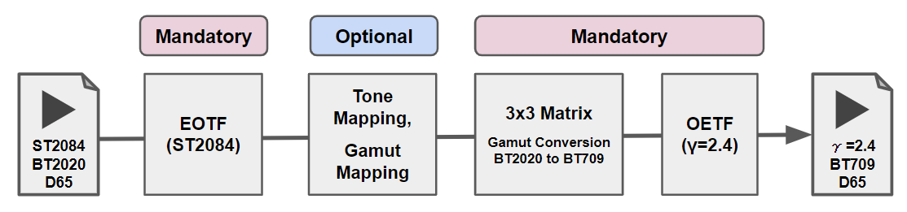
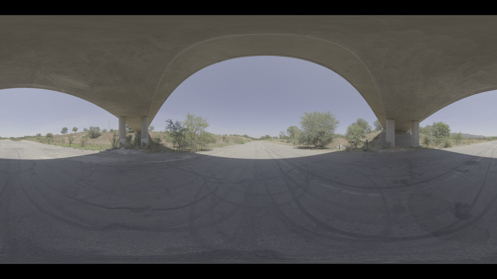
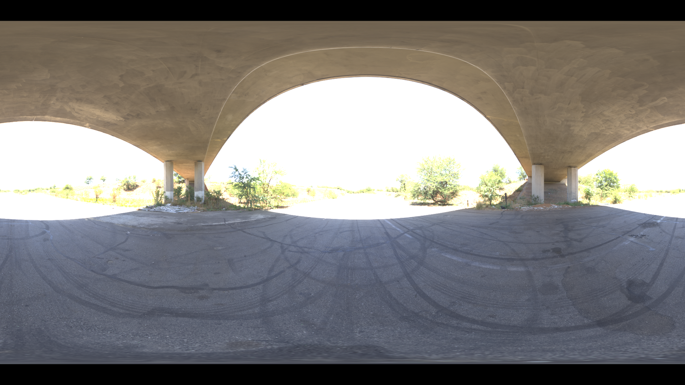
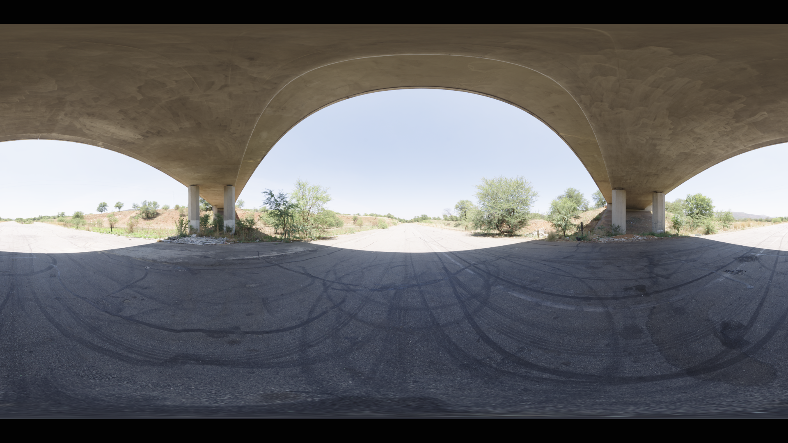

# HDR to SDR 変換の紹介

## 1. 目的

* HDR(※1) to SDR 変換には大きく分けて 3 Step あることを紹介する
* 筆者が [以前の記事](https://trev16.hatenablog.com/entry/2019/08/13/200541) で作成した 3DLUT は、そのうちの 2 Step しか実行してない簡略型であることを示す

※1 本記事で扱う HDR 信号はコンシューマ向けの HDRビデオ信号(HDR10)を想定しています。業務用の HDR ビデオ信号(ACESなど)は想定していません。

## 2. 背景

前回投稿した記事 [Python を利用した簡単な 3DLUT の作成](https://trev16.hatenablog.com/entry/2019/08/13/200541) にて、筆者は以下の記述をした。

> 今回作成した 3DLUT は Tone Mapping や Gamut Mapping などの最適化処理は一切実施していない。単純な数値変換を行っただけである。そのため、実コンテンツに対して ST2084, BT2020, D65 to Gamma2.4, BT709, D65 変換すると白飛びなどのアーティファクトが多数発生してしまう。

Twitter で「この部分が気になる」とのご指摘を受け、「たしかに適当にお茶を濁した書き方で良くないな」と改めて実感したので補足資料を作ることにした。

## 3. 結論

### 3.1. HDR to SDR 変換の 3 Step

多くの HDR to SDR 変換は以下の 3 Step で行われる(※2)。合わせて処理の流れを図1に示す。

1. HDR の Code Value 値から Linear 値への変換(Decode)
2. Tone Mapping, Gamut Mapping を利用したコンテンツの変換  (Look Modification)
3. Linear 値から SDR の Code Value 値への変換(Encode)

※2 2点の資料[1][2]および経験を元に筆者が独自に設定

### 3.2. 以前の記事で作成した 3DLUT が簡略型であることの提示

筆者が以前に作成した 3DLUT は Step1, Step3 しか実行しない簡略型であった。すべての Step を実行した場合との比較を図2に示す。

| 説明 | コンテンツ |
|:----|:------------|
|オリジナル(HDR)||
|SDR変換(Look Modification なし)||
|SDR変換(Look Modification あり)||

## 4. 解説

### 4.1 HDR to SDR 変換の 3 Step

なぜ、この 3 Step が必要なのかを解説する。

## ?. 参考資料

[1] ITU-R BT.2390-6, "High dynamic range television for production and international programme exchange", https://www.itu.int/dms_pub/itu-r/opb/rep/R-REP-BT.2390-6-2019-PDF-E.pdf

[2] Ultra HD Forum, "Ultra HD Forum Guidelines, Revision: 2.0", https://ultrahdforum.org/wp-content/uploads/Ultra-HD-Forum-Guidelines-v2.0.pdf

[3] ITU-R BT.2047-0, "Colour gamut conversion from Recommendation ITU-R BT.2020 to Recommendation ITU-R BT.709", https://www.itu.int/dms_pub/itu-r/opb/rep/R-REP-BT.2407-2017-PDF-E.pdf

[4] Ihor Szlachtycz, "Using AMD FreeSync 2 HDR: Gamut Mapping", https://gpuopen.com/using-amd-freesync-2-hdr-gamut-mapping/
