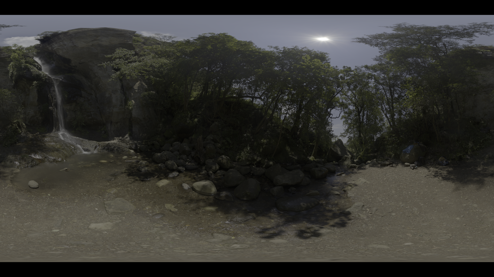
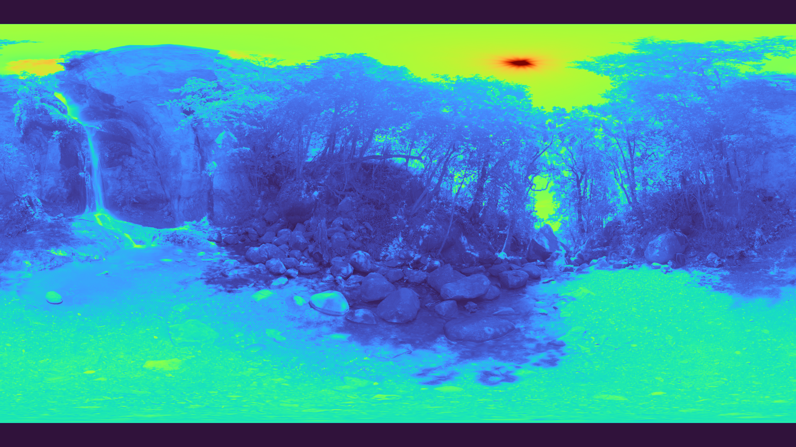
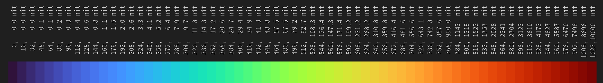
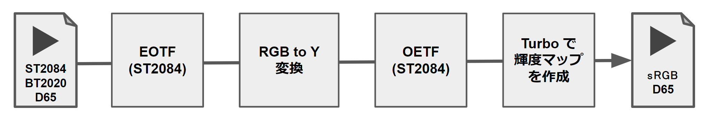
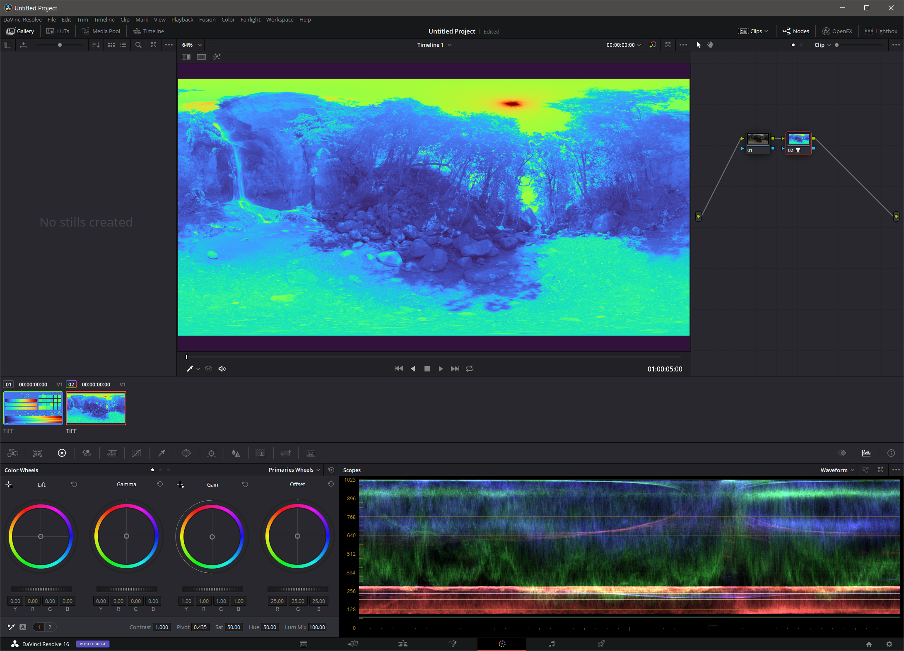

# Turbo を利用した HDR10 画像の輝度マップ作成

## 目的

* Turbo[1] を使って遊ぶ
* 題材として HDR10 画像の輝度マップを作成してみる

## 背景

Google AI Blog にて **Turbo** という Rainbow Colormap が発表された。
面白そうなので遊ぶことにした。

## 結論

* Turbo で遊んだ。楽しかった(小並感)。
* 適当な HDR10 画像の輝度マップを作成した。結果を 図1, 図2 に、輝度と色の関係を 図3 に示す。

| 説明 | 作成した図。上から順に図1，図2|
|:----|:--------------------:|
|オリジナル(HDR10)|    |
|輝度マップ|    |



## 処理概要

処理概要を図4に示す。



詳細説明は省略する。ソースコード(```make_luminance_map.py```)は以下の場所に置いたので必要であれば参照して頂きたい。

## 感想

想像してたよりずっと良かった！

## おまけ

3DLUT も作った。ココ に置いてある。Davinci Resolve で使ってみた様子を 図5 に示す。



## 参考資料

[1] Google AI Blog, "Turbo, An Improved Rainbow Colormap for Visualization", https://ai.googleblog.com/2019/08/turbo-improved-rainbow-colormap-for.html