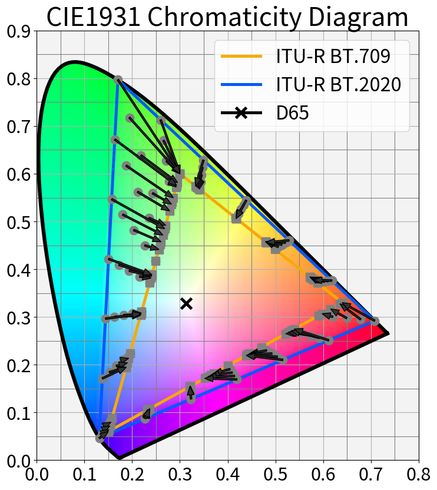
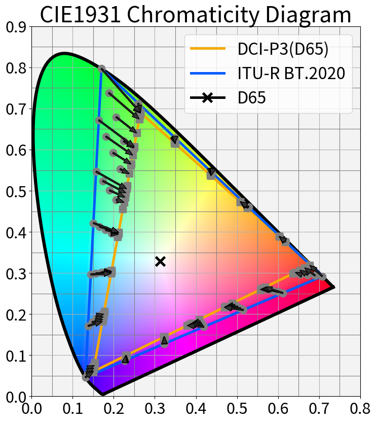

# 色域変換と色域外データのクリッピングについて

## 目的

3x3 の Matrix を使用した単純な変換な色域変換を行うと、変換先の色域(※)によっては色域のクリッピングが生じて想定外の色相のズレが生じることを図で書く。

※BT.2020 のような広色域から BT.709 のような狭い色域に変換した場合など

※※本記事は完全に自分用のメモなので第三者が読むと相当に難だだと推測します。

## 背景

前回の記事で作成した色域確認用のテストパターンは、色域変換による色域のクリッピングの特性を利用した特殊パターンとなっている。なので、そのアイデア元となる「色域変換と色域外データのクリッピング」について簡単に情報を残すことにした。

## 結論

BT.2020 を BT.709/DCI-P3(D65) に変換した際の、色域外の色の変化を可視化した。D65に向かって内側の色域に張り付いている色もあれば、不自然な色相のズレを生じている色もある。

| BT.2020 to BT.709 | BT.2020 to DCI-P3(D65) |
|:-----------------:|:-----------------------:|
||

## 色域変換のやり方とクリッピング

色域変換は様々な制作ツールでサポートされており、誰でか簡単に実行することができる。

ここでは筆者の環境の都合で Colour Science for Python を使った例を示す。

```python
import numpy as np
from colour import xyY_to_XYZ, XYZ_to_RGB, RGB_to_XYZ, XYZ_to_xyY
from colour.models import BT709_COLOURSPACE

# BT.709色域外の xyY データ。Y は Green の Primariy に合わせた。
xyY_bt2020 = np.array([[0.26666249, 0.47998497, 0.67799807],
                       [0.25055208, 0.5328208,  0.67799807],
                       [0.23444166, 0.58565664, 0.67799807],
                       [0.21833125, 0.63849248, 0.67799807],
                       [0.20222083, 0.69132832, 0.67799807],
                       [0.18611042, 0.74416416, 0.67799807],
                       [0.17,       0.797,      0.67799807]])

d65 = np.array([0.3127, 0.3290])

if __name__ == '__main__':
    # とりあえず XYZ する
    large_xyz_bt2020 = xyY_to_XYZ(xyY_bt2020)

    # BT.2020 の XYZ --> BT.709 の RGB へ変換
    rgb_linear_bt709 = XYZ_to_RGB(
        XYZ=large_xyz_bt2020, illuminant_XYZ=d65, illuminant_RGB=d65,
        XYZ_to_RGB_matrix=BT709_COLOURSPACE.XYZ_to_RGB_matrix)

    # BT.709 の色域内にクリッピング
    print(rgb_linear_bt709)
    rgb_linear_bt709_clipped = np.clip(rgb_linear_bt709, 0.0, 1.0)

    # xyY に変換して最終出力する
    large_xyz_bt709_clipped = RGB_to_XYZ(
        RGB=rgb_linear_bt709_clipped, illuminant_RGB=d65, illuminant_XYZ=d65,
        RGB_to_XYZ_matrix=BT709_COLOURSPACE.RGB_to_XYZ_matrix)
    xyY_bt709_clipped = XYZ_to_xyY(large_xyz_bt709_clipped)
    print(xyY_bt709_clipped)

```

ポイントは **BT.709 の色域内にクリッピング** しているところである。
XYZ to RGB 変換後の RGB (表1)を見ると分かるのだが、BT.709 の色域外の値は [0.0:1.0] の範囲をはみ出しており、このままではガンマ補正や量子化が正しく行えない。なので [0.0:1.0] の範囲にクリッピングを行っている。これにより、R:G:B のバランスが崩れて結果的に色相のズレが発生している。

|R   |G|B
|---------------:|---------------:|---------------:|
|-8.80384743e-09 |  9.21687237e-01 |  2.60917363e-01 |
|-1.46500129e-01 |  9.74342980e-01 |  1.70795605e-01 |
|-2.66566875e-01 |  1.01749792e+00 |  9.69347620e-02 |
|-3.66762314e-01 |  1.05351062e+00 |  3.52980140e-02 |
|-4.51642605e-01 |  1.08401868e+00 | -1.69173559e-02 |
|-5.24469819e-01 |  1.11019457e+00 | -6.17181265e-02 |
|-5.87641137e-01 |  1.13289989e+00 | -1.00578898e-01 |