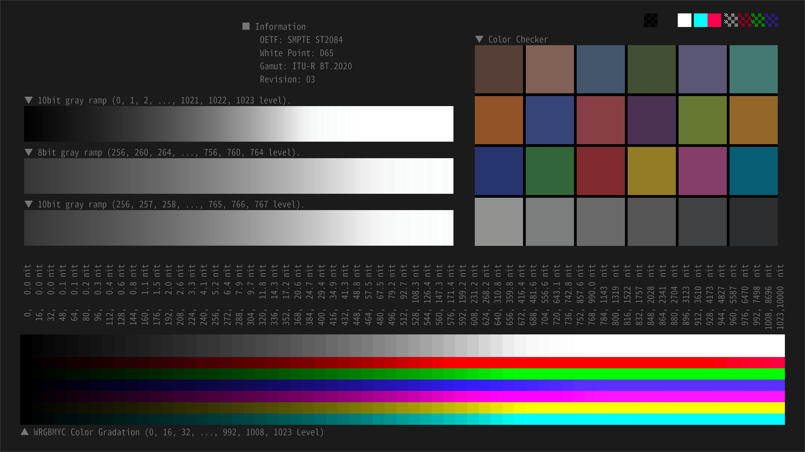
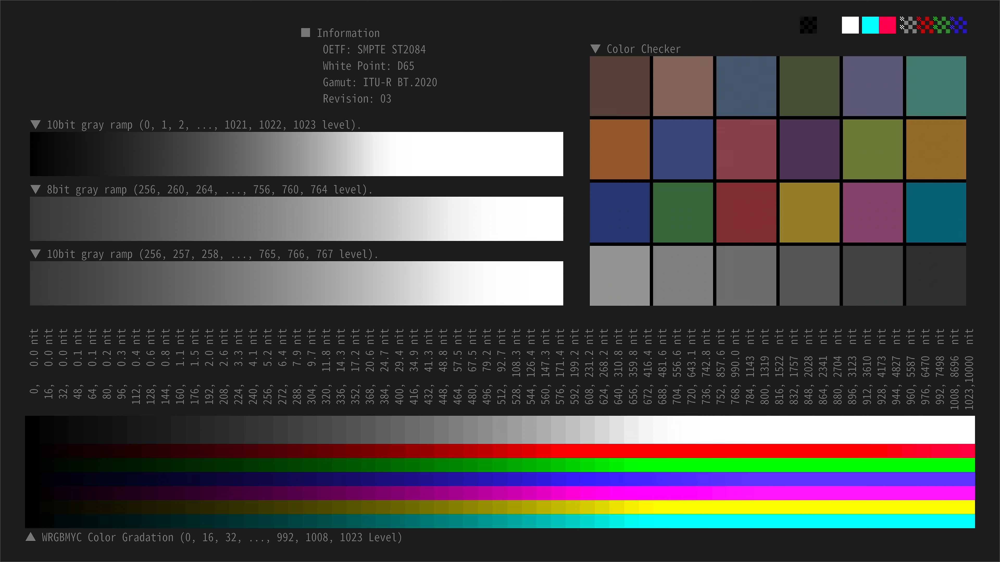

# YouTube の HDR to SDR 変換を調べて 3DLUT化する

## 背景

YouTube に HDR動画をアップロードすると、SDRデバイス向けにサーバー側で自動的に HDR to SDR 変換が行われる。この変換のアルゴリズムは公開されていないため、投稿者が SDR動画を目にするのは投稿後に限定されてしまう。投稿後にしか SDRの動画を確認できないのは、なかなか不便であるため、なんとかしたいと考えた。

## 目的

HDR動画の投稿前にSDRの動画がどうなるかをプレビューできるよう、YouTube の HDR to SDR変換を解析し3DLUT化する。

## 懸念事項

HDR to SDR 変換の解析のためには、YouTube の SDR動画のデータを入手する必要がある。当然のことながら動画データのダウンロードは規約違反である。

[利用規約 - YouTube ](https://www.youtube.com/static?template=terms&hl=ja&gl=JP)
> お客様は、「ダウンロード」または同様のリンクが本コンテンツについて本サービス上でYouTubeにより表示されている場合を除き、いかなる本コンテンツもダウンロードしてはなりません。

本記事は「ダウンロードは NG だが画面スクショならギリギリセーブ」という独自の見解に基づいて書くことにしたが、常識的に考えるとアウト（あるいは限りなく黒に近いグレー）である。ただ、SDR動画の事前プレビューが出来ないのは深刻に不便なので解析は決行することにした。

## 結論

YouTube の HDR to SDR 変換をエミュレーションする 3DLUT を作成した。3DLUT を適用した結果と 実際の YouTube での変換の比較を図1に示す。

3DLUT で特に違和感なくエミュレーションできている。

| 項目 | 図 |
|:--------------------------:|:--------------------------:|
| 3DLUT でのエミュレーション |   |
| 本家 YouTube での変換 |  |

## 原理

筆者は、YouTube では図1のような変換が行われていると推測している。これを図2に示すように 3DLUT でエミュレーションする。

## 3DLUT の作成方法

非常にシンプルである。以下の4ステップを実行すれば良い。

1. $65^3 = 274,625$ 点のHDR形式のパッチ動画を作成
2. HDRパッチ動画を YouTube へアップロード
3. SDR環境で 2. の動画を再生して SDR変換後の $274,625$ 点のパッチをキャプチャ
4. キャプチャデータから HDR⇔SDR の対応関係を調べて3DLUT化

一番大変なのは 3. だが、幸い今回のケースでは 139枚のキャプチャで済むので1時間もあれば作業は終わる。現実的な時間で完了する作業量である。

なお、作成したHDRパッチ動画は以下である。HDR対応TVなどで再生すればHDR動画として再生されるが、SDR環境では SDR動画として再生される。

https://youtu.be/guop9cohJa8

## 感想

これで YouTube にアップする前に SDRの確認が出来るようになった。大変便利である。

その一方で、Tone Mapping, Gamut Mapping がどのように行われているか気になってきてしまった。Tone Mapping については少し調べて記事を書くかもしれない。

