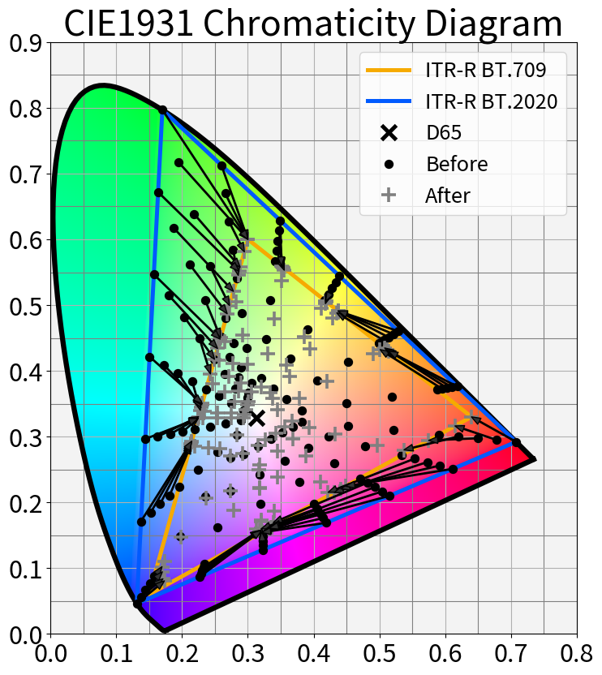
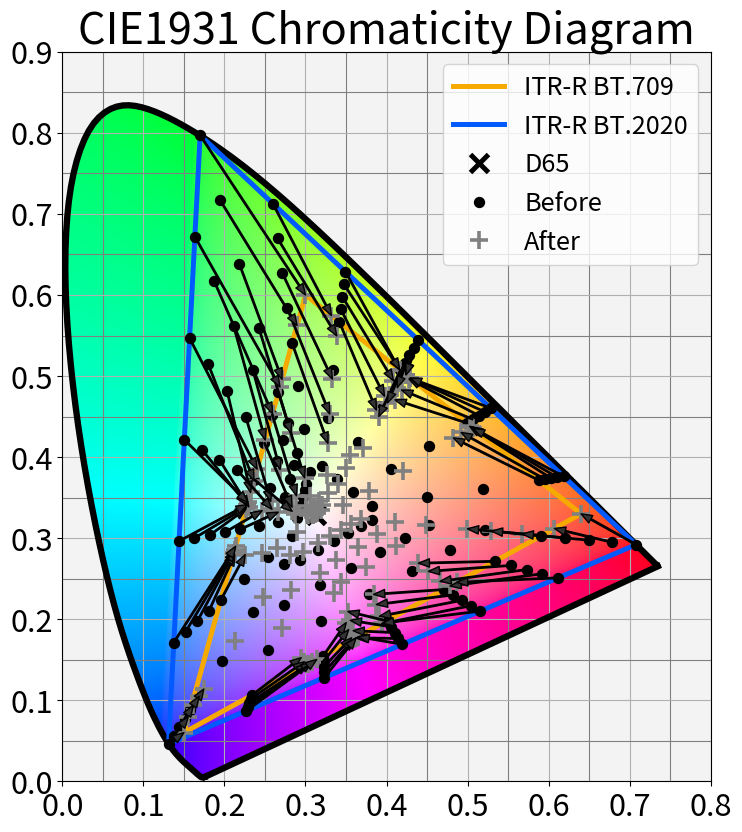

# YouTube の HDR to SDR 変換の特性を少し調べる

## 1. 背景

[前回の記事](https://trev16.hatenablog.com/entry/2019/10/27/123425) で YouTube が行っている HDR to SDR 変換をエミュレーションする 3DLUT の作成に成功した。これにより、HDR動画を YouTube へアップロードする前に SDR 変換のプレビューが出来るようになった。

その一方で、色々とコンテンツを弄っていると、この 3DLUT を完全なブラックボックスとして利用するのではなく、ある程度は変換の特性を理解した上で利用した方が有用だと考えた。なので 3DLUT の特性を少しだけ解析した。

## 2. おことわり

本記事は自分の持っている知識を総動員して作成したが、今回の記事に関連する分野は事前知識に乏しく、調査の方針から考察に至るまで見当違いの事を行っている可能性がある。注意して頂きたい。

## 3. 結論

**Gray** および **BT709の色域外の色** の変換特性について調査した結果、以下の事実が分かった。

* Gray に対しては 400 cd/m2～1000 cd/m2 にかけてロールオフするような Tone Mapping が掛かっている
  * 図1 に 3DLUT より求めた特性および推測した特性値を示す(図の詳細は後述する)
* BT.2020 to BT.709 の色域変換の際、色域外の色に対しては単純な 3x3 の行列変換ではなく、何らかの補正処理が行われている<要追加調査>
  * 図2、図3 に単純な 3x3 の行列変換の場合との比較を示す(図の詳細は後述する)

図1. 3DLUTから求めた特性(青線)および推測した変換特性(橙線)

|     |   |
|:-------:|:-------:|
| 図2 YouTube で変換した結果   | 図3 Tone Mapping ＆ 3x3 の単純な Matrix で変換した結果 |

## 4. 調査

### 4.1. Gray の特性調査

HDR to SDR の Tone Mapping に関する解説記事は幾つもあるが、今回は ITU-R BT.2390[1] を参考に調査することにした。BT.2390 では図4 に示すように **EETF** という概念で Tone Mapping(※) を表現している。

※BT.2390 の文中では **Display Mapping** と表現されている。理由は…本編とは関係ないので省略する。

図4. BT2390 での EETF を含めた処理ブロック図

図4 はカメラで撮影した画を加工する形式のため OOTF が入っている。が、今回のケースはソースが ST2084 であり OOTF は既に適用済みであるため、図5 のようにモデル化する。

図5. 今回のケースでの EETF を含めた処理ブロック図

図5 のデータから EETF を抽出するために、図5 の処理に加えて γ=2.4 の EOTF および ST2084 の OETF を適用する(図6)。こうすることで 3DLUT 内部で行っている(と推測している) ST2084 の EOTF と Gamma=1/(2.4) の OETF をキャンセルする事ができて EETF の特性が分かる（はず）。

図6. 3DLUT 内部の余分な処理をキャンセルするためのブロック図

実際に図6の計算を行った結果を図7、図8に示す。図7は横軸縦軸が ST2084 の Code Valueに、図8 は Luminance になっている。図8 で高輝度領域が青線が波打っているのはサンプル数の不足に起因するものであり、下に凸になっている箇所は誤差が大きい箇所だと推測している。

|     |   |
|:-------:|:-------:|
| 図7 算出したEETF(Code Valueベース)       | 図8 算出したEETF(Luminance ベース)       |

図7 を見ると、横軸の 0.0～0.65 あたりは直線で、0.65～0.75 は適当な曲線で緩やかにロールオフさせ、0.75以降は再び直線で表現すれば数式化できそうである。ということで以下の式(1)のように数式化した。

$$
f(x) = \left\{
\begin{array}{ll}
0.74x + 0.01175 & (0 \leq x \lt 0.653) \\
ベジェ曲線で繋ぐ(式は長いので省略) & (0.653 \leq x \lt 0.752) &  &  &  & (1)\\
0.50808 & (0.752 \geq x)
\end{array}
\right.
$$

<!-- 

[tex: \displaystyle
f(x) = \left\{
\begin{array}{ll}
0.74x + 0.01175 & (0 \leq x \lt 0.653) \\
ベジェ曲線で繋ぐ(式は長いので省略) & (0.653 \leq x \lt 0.752) &  &  &  & (1)\\
0.50808 & (0.752 \geq x)
\end{array}
\right.
]

-->

急に登場した 0.50808, 0.653, 0.752 はそれぞれ、100cd/m2, 400cd/m2, 1000cd/m2 に対応する ST2084 の Code Value値である。従って推測した EETF の特性は「400cd/m2 以下の領域は 傾き 0.74 の直線」かつ「400～1000cd/m2 で緩やかにロールオフ」する特性を持つと言うことができる。

この数式を先ほどの図に上からプロットしてみた。結果を図9、図10 に示す。まあまあ良い感じに特性を模倣できているのが分かる。

|     |   |
|:-------:|:-------:|
| 図9 推定した数式をプロット(Code Valueベース) | 図10 推定した数式をプロット(Luminanceベース) |

さて、ここまでの分析はグレー成分しか存在しないモノクロのパターンを利用して行った。それでは推測した Tone Mapping の特性を自然画に適用したらどうなるだろうか。試しに筆者のNASから発掘した HDR の静止画ファイルを用いて確認してみた。

結果を図11～図13 に示す。これらの図はアニメーションPNGとなっており YouTube で変換した正解画像と 推測した Tone Mapping の数式で変換した画像が交互に表示される。

図11. 神社の写真

図12. 海の写真

図13. いつものテストパターン

図を見ると分かるように一致していない。色がついている箇所の特性は Tone Mapping のみでは模倣できないようである。この件については別記事でもっと詳しく解析…したい。

### 4.2. 色域外の色の調査

色域外の色がどのように変化しているか、簡単なパッチを作成して確認した。結果を図14、図15 に示す。図中の矢印は色域変換の前後での色の移動を示している。図15 の Matrix 方式では色域外の色が D65 付近に移動するケース、すなわち色情報が飛ぶケースが多々ある。一方で図14 の YouTube 方式は D65付近への移動がなく、色情報の損失が抑えられていることが分かる。

|     |   |
|:-------:|:-------:|
| 図14 YouTube で変換した結果   | 図15 Tone Mapping ＋ 3x3 の単純な Matrix で変換した結果 |

図14、図15 についてもう少し解説する。これらの図は HDR10 信号の 1000nits 付近の輝度を持つパッチの xy色度図上の変化をプロットしたものである。具体的なパッチの変化を図16に示す。 図15の Matrix方式では色が変化してしまっていることが良く分かる。

図16. 確認用パッチでの色の比較

## 5. 感想

思いつきで調査を始めてみたが、分からないことが多すぎてなかなか困った。もう少し事前知識を身につける必要があるのを痛感した。

## 6. 参考資料

[1] Report ITU-R BT.2390-7, "High dynamic range television for production and international programme exchange", https://www.itu.int/pub/publications.aspx?lang=en&parent=R-REP-BT.2390-7-2019
