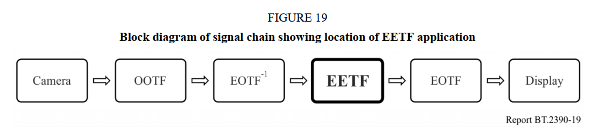
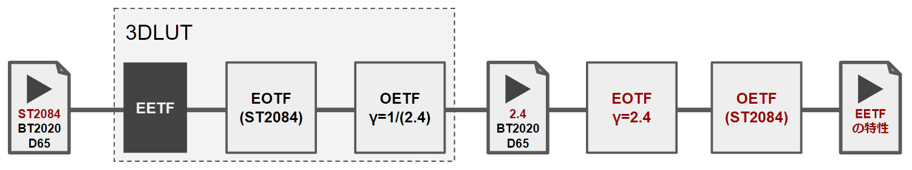
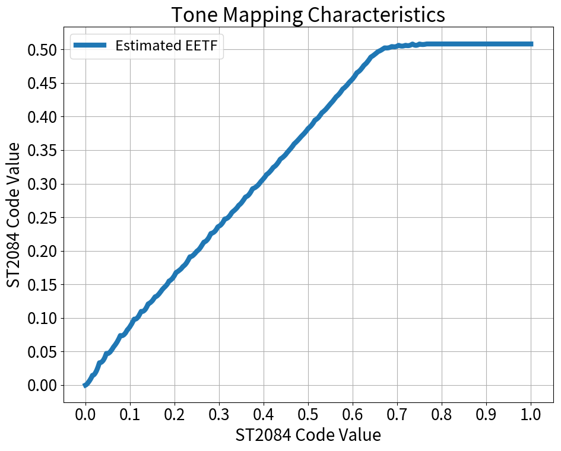
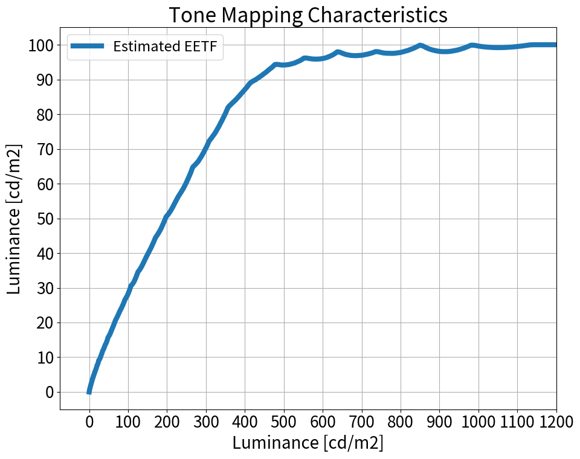
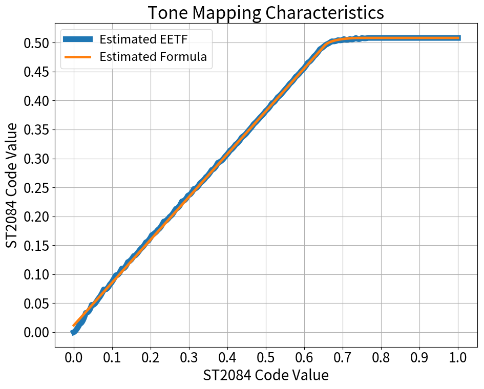
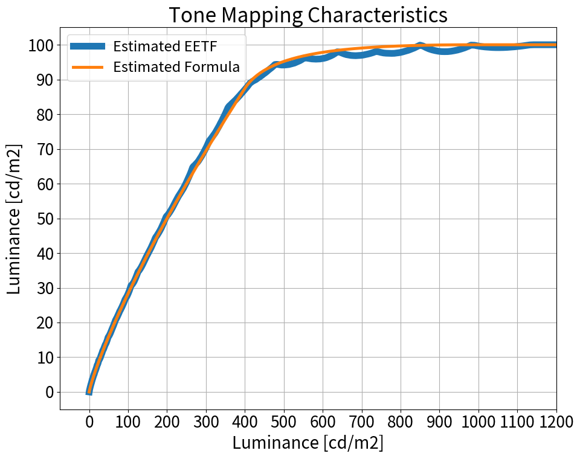

# YouTube の HDR to SDR 変換の特性を少し調べる

## 1. 背景

[前回の記事](https://trev16.hatenablog.com/entry/2019/10/27/123425)で YouTube が行っている HDR to SDR 変換をエミュレーションする 3DLUT の作成に成功した。これにより、HDR動画を YouTube へアップロードする前に SDR 変換のプレビューが出来るようになった。

その一方で、色々とコンテンツを弄っていると、この 3DLUT を完全なブラックボックスとして利用するのではなく、ある程度は変換の特性を理解した上で利用した方が有用だと考えた。なので 3DLUT の特性を少しだけ解析した。

## 2. 結論

**Gray** および **BT709の色域外の色** の変換特性について調査した結果、以下の事実が判明した。

* Gray に対しては 400 cd/m2～1000 cd/m2 にかけてロールオフするような Tone Mapping が掛かっている
  * 図1 に 3DLUT より求めた特性および推測した特性値を示す
* BT.709 の色域外の色に対して、単純な 3x3 の行列変換ではなく、何らかの補正処理が行われている<要追加調査>
  * 図2 に単純な 3x3 の行列変換の場合との比較を示す

## 3. 調査方法

### 3.1. Gray の特性調査

HDR to SDR の Tone Mapping に関する解説記事は幾つもあるが、今回は ITU-R BT.2390[1] を参考に調査することにした。BT.2390 では図x に示すように **EETF** という概念で Tone Mapping(※) を表現している。

※BT.2390 の文中では **Display Mapping** と表現されている。理由は…本編とは関係ないので省略する。

図x. BT2390 での EETF を含めたブロック図

図x はカメラで撮影した画を加工する形のため OOTF が入っている。が、今回のケースはソースが HDR(PQ) であり OOTF は既に適用済みであるため、図x のようにモデル化する。

図x. 今回のケースでの 3DLUT を含めたブロック図

図x のデータから EETF を抽出するため、図x の処理に加えて γ=2.4 の EOTF および ST2084 の OETF を適用する。こうすることで 3DLUT 内部で行っている(と推測している) ST2084 の EOTF と Gamma=1/(2.4) の OETF をキャンセルする事ができて EETF の特性が分かる（はず）。

図x. 3DLUT 内部の余分な処理をキャンセルするためのブロック図

実際に図xの計算を行った結果を図x、図xに示す。図xは横軸縦軸が ST2084 の Code Valueに、図x は Luminance になっている。

|     |   |
|:-------:|:-------:|
| 図x       | 図x        |

図x を見ると、横軸の 0.0～0.65 あたりは直線で、0.65～0.75 は適当な曲線で緩やかにロールオフさせ、0.75以降は再び直線で表現すれば近似できそうである。ということで以下のように近似した。

$$
f(x) = \left\{
\begin{array}{ll}
0.74x + 0.01175 & (0 \leq x \lt 0.653) \\
ベジェ曲線で繋ぐ(式は長いので省略) & (0.653 \leq x \lt 0.752)\\
0.50808 & (0.508 \geq x)
\end{array}
\right.
$$

急に登場した、0.653 と 0.752 はそれぞれ、400cd/m2、1000cd/m2 に対応する ST2084 の Code Value値である。従って、推測したEETFの特性は言い換えると、「400cd/m2 以下の領域は 傾き 0.74 の直線の特性」かつ「400～1000cd/m2 で緩やかにロールオフ」する特性を持つことを意味する。

この数式を先ほどの図に上からプロットしてみた。結果を図x、図x に示す。

|     |   |
|:-------:|:-------:|
| 図x       | 図x        |

### 3.2. 色域外の色の調査

## X. 参考資料

[1] Report ITU-R BT.2390-7, "High dynamic range television for production and international programme exchange", https://www.itu.int/pub/publications.aspx?lang=en&parent=R-REP-BT.2390-7-2019

[2] 
