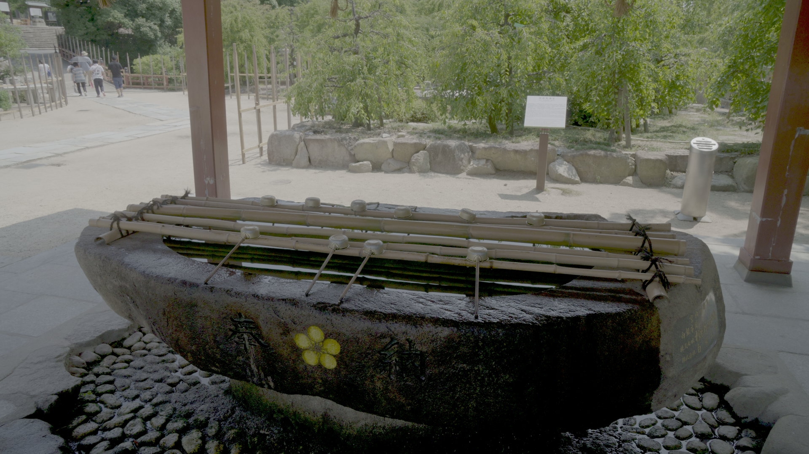
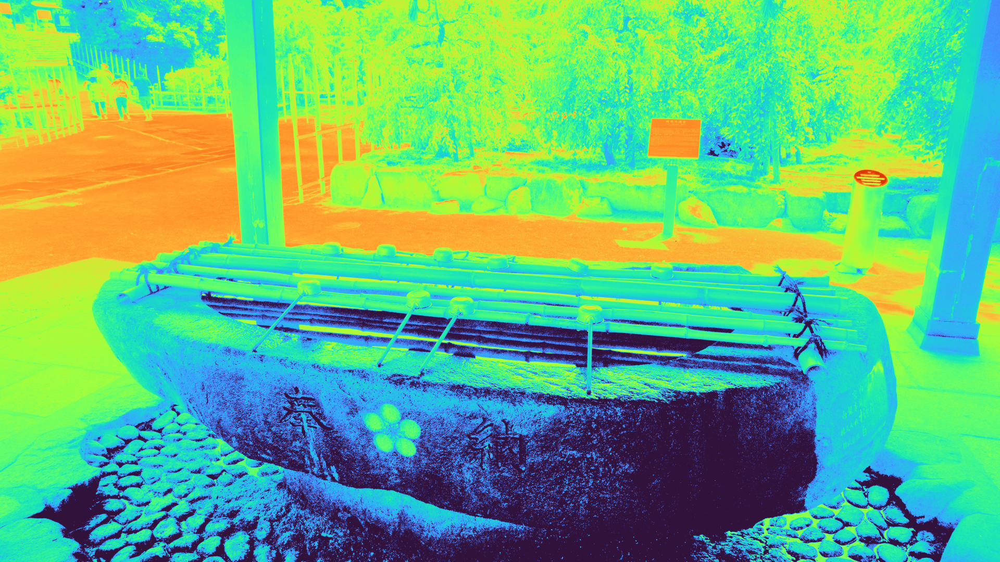
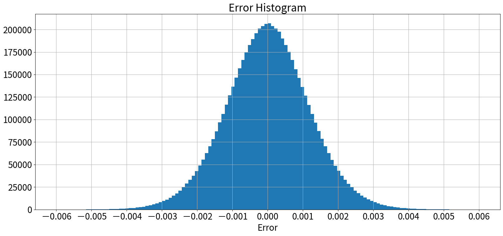

# Colour Science for Python の 3DLUT モジュールを使う

## 背景

これまで 3DLUT を適用する際は外部ツール(DaVinci Resolve, Nuke) を使用してきた。が、毎回外部ツールを起動するのは大変面倒くさい。ということで Python で 3DLUT を適用できる環境を構築する。ついでに 1DLUT も環境が構築できないか検討する。

自分でコードを組むことも考えたが、既に Color Science for Python にコードがあるので利用させて頂くことにした。

## 目的

Python 上でお手軽に 3DLUT(+1DLUT) を適用できる環境を整える。

## 結論

* 1DLUT/3DLUT の LUTファイルの Write/Read 環境が整った
  * 精度が不足していたのでコードの一部にパッチを当てた(後述)
* 3DLUT を画像に適用する環境が整った
* 1DLUT を画像に適用する環境は、今回は構築しないことにした(詳細は本記事では説明しない)
  * 筆者はややトリッキーな使い方をするのだが、それに対応していなかった

以下にHDR10画像に 3DLUT を適用するコードの例、および生成された画像を示す。

```python
from colour import read_LUT
from colour import write_image, read_image

def apply_hdr10_to_turbo_3dlut():
    """
    HDR10の静止画に3DLUTを適用してsRGB の輝度マップを作る。
    """
    hdr_img = read_image("./img/test_src_for_youtube_upload_riku.tif")
    lut3d = read_LUT("./luts/PQ_BT2020_to_Turbo_sRGB.cube")
    luminance_map_img = lut3d.apply(hdr_img)
    write_image(luminance_map_img, "./blog_img/3dlut_sample_turbo.png",
                bit_depth='uint8')

if __name__ == '__main__':
    apply_hdr10_to_turbo_3dlut()
```

| 図1. HDR10画像(ソース) | 図2. 3DLUTで変換した画像 |
|:--------------:|:--------------:|
| |  |


## 調査

### 調査方針

Color Science for Python で 1DLUT/3DLUT を制御するのに使用するモジュールは [LUT1D](https://colour.readthedocs.io/en/v0.3.14/generated/colour.LUT1D.html#colour.LUT1D) および [LUT3D](https://colour.readthedocs.io/en/v0.3.14/generated/colour.LUT3D.html#colour.LUT3D) である。これらが筆者の使用環境で問題無いことを示すために、以下の内容を調査した。

* 3DLUTファイル(.cube, .spi3d)の write/read
  * 負の値、極端に小さい値、1.0を超える値の Write/Read も確認
* 1DLUTファイル(.cube, .spi1d)の write/read
  * 負の値、極端に小さい値、1.0を超える値の Write/Read も確認
* 画像に 3DLUT を適用
  * 0.0～1.0 の範囲外の入力値のクリップ確認
  * 0.0～1.0 の範囲外のLUT値を通った後の出力値確認
* 画像に 1DLUT を適用
  * 0.0～1.0 の範囲外の入力値のクリップ確認
  * 0.0～1.0 の範囲外のLUT値を通った後の出力値確認
* 1DLUT の逆変換 の適用
  * OCIO の `direction=inverse` 的なやつ
* 乱数データを利用した 3DLUT の精度確認

### 調査の実施

以下のコードで確認した。

`check_3dlut_module.py`

### 調査結果

以下の2項目がNGであった。

1. 1DLUT/3DLUT ファイルに極端に小さい値(`1.1754944e-38`など) が書き込めない（LUTファイルの吐き出しが指数表記に対応していない）
2. 1DLUT の逆変換ができない

このうち 1. に関しては [`write_LUT`](https://colour.readthedocs.io/en/v0.3.14/generated/colour.write_LUT.html#colour.write_LUT) にパッチを当てれば解消することが判明した。なので[パッチ](https://github.com/toru-ver4/docker/tree/develop/python_environment/patches)を当てて対応した。

そして 2. に関しては現時点での運用は諦めて、後で自身でコードを書く方針とした。一方で早急に必要な機能ではないため、時が来るまでは放置しておくことにする。

### その他

**乱数データを利用した 3DLUT の精度確認** では DaVinci Resolve および Nuke の出力結果と比較する手法を取った。Nuke との比較結果は誤差が `e-07` オーダーだったので問題なかったのだが、DaVinci Resolve の方は地味に誤差があった。入出力の範囲が `[0.0:1.0]` である6M点のサンプルに対する誤差のヒストグラムを図3 に示す。



なぜこうした誤差が生じているのかは調査できていない。いつか原因が分かれば報告したい。

## 感想

そこそこ真面目にライブラリの動作確認をすることができた。これで安心して LUT3D モジュールを使うことができる。

ここ数週間で行ってきた BT.2407 および BT.2446 の実装に向けた開発環境のアップデートはこれで完了である。明日からは本命の処理に取り組んでいく。

## 参考資料

* Colour, "Colour -- Reference -- Colour -- Input and Output -- Look Up Table (LUT) Data", https://colour.readthedocs.io/en/v0.3.14/colour.io.html#look-up-table-lut-data