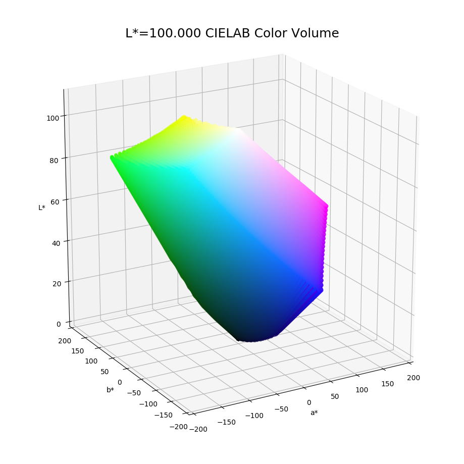
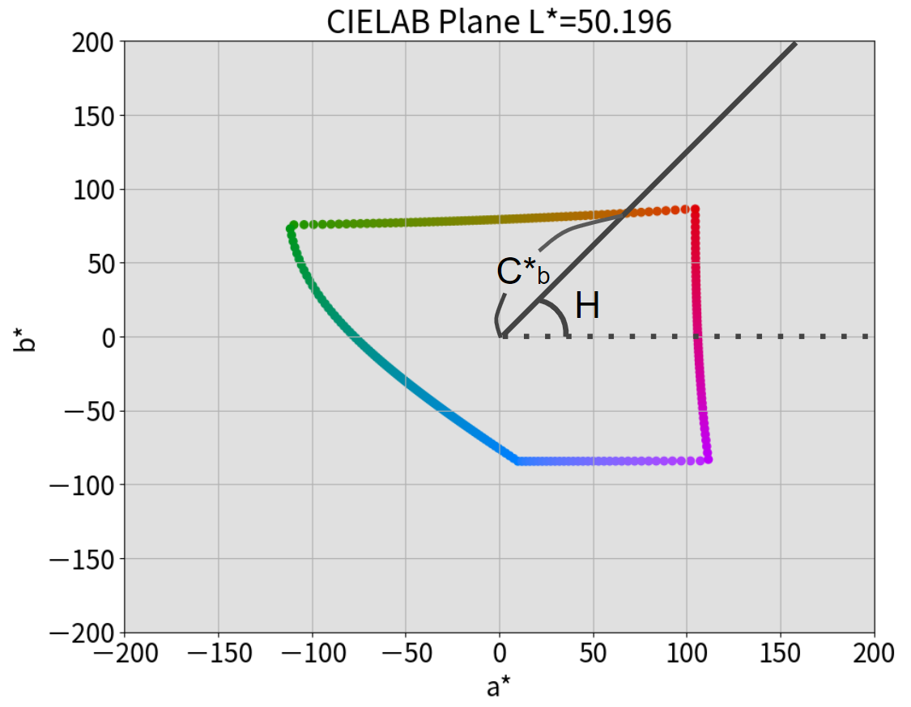

# CIELAB色空間で BT.2020色域の Gamut Boundary をプロットする

## はじめに

この記事は「Report ITU-R BT.2407 の Annex2 を実装」シリーズの2回目です。前回は xyY色空間でしたが、今回からは CIELAB色空間の話になります。

今回の記事は残念ながら上手く書けませんでした。もっと色々と時間をかけて追記したかったのですが、個人的な都合で断念しています。図と動画だけ見るのを推奨します。いつか書き直したいです。

## 背景

BT.2407 の Annex2(以後、BT.2407と略す) の実装には、CIELAB色空間における BT.2020色域 および BT.709色域の Gamut Bounary の算出が必要である。前回の記事では事前確認として xyY色空間で Gamut Boundary を算出したが、今回は本命の CIELAB色空間で Gamut Boundary を算出することにした。

## 目的

* CIELAB色空間で BT.2020色域の Gamut Boundary を算出してプロットする。

## 結論

筆者独自方式で CIELAB色空間での BT.2020色域の Gamut Bounadry の算出に成功した。結果を図1に示す。

図1. Gamut Boundary

## 算出方法

### 方針

基本的な方針は前回の記事と同様である。以下の動画のように a\*b\* 平面を L\* 方向に積み重ねて CIELAB空間を表現することで Gamut Boundary を算出することにした。

---

https://www.youtube.com/watch?v=NNz7cpvkxRY&feature=youtu.be

---

したがって、解くべき問題は **CIELAB色空間における 任意の L\* に対する a\*b\*平面の Gamut Boundary の算出** となった。言い換えると、上の動画の左画面 の Gamut Boundary を算出するのが目的である。

### 理論

前回の記事と同様に CIELAB色空間の単純な特性を利用して a\*b\* 平面の Gamut Boundary を求めることにした。その特性とは **CIELAB色空間の Gamut Boundary の外側の L\*a\*b\* 値は RGB値へ変換すると 0.0～1.0 の範囲を超える** である。

したがって本記事では以後 a\*b\* 平面にて 0.0～1.0 の範囲を超える 場所の探索方法について論じていく。

### 定式化

前項で述べた性質を利用するためには L\*a\*b\* to RGB 変換が必要である。ここでは変換式の定式化を行う。

まず、XYZ to L\*a\*b\* の計算式を確認する。計算式は以下の通りである[1][2]。

$$
\begin{array}{ll}
L^{*} &= 116 f\displaystyle\left(\frac{Y}{Y_n}\right) -16 \\
a^* &= 500 \displaystyle\left(f\left(\frac{X}{X_n}\right) - f\left(\frac{Y}{Y_n}\right)\right) \\
b^* &= 500 \displaystyle\left(f\left(\frac{Y}{Y_n}\right) - f\left(\frac{Z}{Z_n}\right)\right)
\end{array}
$$

ここで $X_n, Y_n, Z_n$ は白色点の XYZ値を意味する。また $f(t)$ は以下の通りに定義される。

$$
f(t) = \left\{
\begin{array}{ll}
\displaystyle\ t^{1/3} & \text{if } t > \sigma ^3 \\
\displaystyle\frac{t}{3\sigma ^2} + 4/29 & \text{otherwise}
\end{array}
\right.
$$

なお、$\sigma = 6/29$ である。

これの逆関数を計算すると L\*a\*b\* to XYZ の計算式が得られる。結果は以下の通りである。

$$
\begin{array}{ll}
X = X_n f^{-1} \displaystyle\left(\frac{L^* + 16}{116} + \frac{a^*}{500}\right) \\
Y = Y_n f^{-1} \displaystyle\left(\frac{L^* + 16}{116}\right) \\
Z = Z_n f^{-1} \displaystyle\left(\frac{L^* + 16}{116} - \frac{b^*}{200}\right)
\end{array}
$$

$$
\begin{array}{ll}
f^{-1}(t) = \left\{
\begin{array}{ll}
t^3  & \text{if } t > \sigma \\
3 \delta^{2} \displaystyle\left(t - \frac{4}{29}\right) & \text{otherwise}
\end{array}
\right.
\end{array}
$$

さて、続いて XYZ to RGB 変換の数式を組みたいところだが、ここで少し式の表現方法を変える。なぜならば X, Y, Z の数式はそれぞれ $f^{-1}(t)$ が2種類存在するからである。

通常の L\*a\*b\* to XYZ 変換であれば、L\*a\*b\* 値が **確定している** ため、X, Y, Z がそれぞれ2種類あるということは無い。しかし、今回は L\*a\*b\* to RGB 変換後に 0.0～1.0 を超える値を **探索** するため、XYZ値の計算時は L\*a\*b\* が **確定していない**。そのため定式化の段階では **X, Y, Z の各値はそれぞれ2種類ある** とみなす必要がある。

ということで以下に示すように X, Y, Z を定義しなおしていく。

まず、X, Y, Z の $f^{-1}(t)$ の $t$ に該当する箇所をそれぞれ $t_X, t_Y, t_Z$ と置く。

$$
\begin{array}{ll}
X = X_n f^{-1} \displaystyle\left(t_X \right) \\
Y = Y_n f^{-1} \displaystyle\left(t_Y \right) \\
Z = Z_n f^{-1} \displaystyle\left(t_Z \right)
\end{array}
$$

続いて新たに変数 $i, j, k$ を設けて $t_X, t_Y, t_Z$ の値に応じて場合分けする。

$$
\begin{array}{ll}
X_i = \left\{
\begin{array}{ll}
X_n t_X^3 & \text{if } i=0, t_X > \sigma \\
X_n 3 \sigma ^2(t_X - \frac{4}{29}) & \text{if } i=1, t_X \leq \sigma \\
\end{array}
\right. \\
Y_j = \left\{
\begin{array}{ll}
Y_n t_Y^3  & \text{if } j=0, t_Y > \sigma \\
Y_n 3 \sigma ^2(t_Y - \frac{4}{29}) & \text{if } j=1, t_Y \leq \sigma \\
\end{array}
\right. \\
Z_k = \left\{
\begin{array}{ll}
Z_n t_Z^3  & \text{if } k=0, t_Z > \sigma \\
Z_n 3 \sigma ^2(t_Z - \frac{4}{29}) & \text{if } k=1, t_Z \leq \sigma\\
\end{array}
\right. \\
\end{array}
$$

ここで、XYZ to RGB 変換の行列 $M$ を以下の通りに定義する。

$$
M = \begin{bmatrix}
a_{11} & a_{12} & a_{13} \\
a_{21} & a_{22} & a_{23} \\
a_{31} & a_{32} & a_{33} \\
\end{bmatrix}
$$

すると、最終的に L\*a\*b\* to RGB の計算式は以下となる。

$$
\begin{array}{ll}
R_{ijk} = a_{11}X_i + a_{12}Y_j + a_{13}Z_k \\
G_{ijk} = a_{21}X_i + a_{22}Y_j + a_{23}Z_k \\
B_{ijk} = a_{31}X_i + a_{32}Y_j + a_{33}Z_k \\
\end{array}
$$

前述の通り、X, Y, Z はそれぞれ2種類の計算式がある。そして R, G, B値は X, Y, Z の組み合わせで求まる。よって R, G, B値は $i, j, k$ の組み合わせにより **計8通り** 存在する。

さて、更に式に変更を加える。これまでに定式化した RGB値を求める数式は、L\*, a\*, b\* を変数としている。冒頭の動画で示したとおり今回は任意の L\* に対する a\*b\* 平面での Gamut Boundary を求める。よって a\*b\* 平面でのパラメータ探索（方程式の解を求める）をすることになるが、a\* と b\* の2変数だと方程式の解を求めるのが難しい。

そこで図2のように中心から角度$H$の場所に直線を引き、中心からの距離を $C^{*}$ とする。すると $a^*$, $b^*$ は以下の式で表現できる。

$$
\begin{array}{ll}
a^* = C^* \cos{H} \\
b^* = C^* \sin{H} \\
\end{array}
$$

図2. 変数定義

こうすることで、角度$H$ における Gamut Boundary は $C^*$ に関する方程式で表現できる。更に $H$ を 0～360° まで変化させることで a\*b\* 平面での Gamut Boundary を算出可能となる。

ようやく終わりが見えてきた。最後に解くべき方程式についてコメントしておく。$C^*$ を変化させた際に L\*a\*b\* to RGB変換後の値が 0.0～1.0 を超えるポイントを探索するので、方程式としては以下の6通りを求めることになる。

$$
\begin{array}{ll}
R_{ijk} = 0 \\
G_{ijk} = 0 \\
B_{ijk} = 0 \\
R_{ijk} = 1 \\
G_{ijk} = 1 \\
B_{ijk} = 1 \\
\end{array}
$$

…というのは不完全で、R, G, B値は $i, j, k$ の組み合わせにより **計8通り** 存在するので $6 \times 8 = 48$ 通りの方程式を解き、得られた解のうち矛盾が無いもの(※1)のうち正の最小値だったものが 角度 $H$ における Gamut Bondary の位置を示す $C^{*}_b$ となる(※2)。

※1 $i=0$ ならば $t_X > \sigma$、 $i=1$ ならば $t_X \leq \sigma$ などの制約を満たしているかどうか

※2 この辺の説明が下手くそで本当にスミマセン…

## 検証

前回の記事と同様に Gamut Boundary の算出結果が正しいかの検証を行う。今回も厳密な検証は大変そうだったので、目視による検証のみとする。手順は以下の通り。

1. RGB色空間を NxNxN の $N^3$点のサンプルに離散化する
2. $N^3$ 点の RGB値 を L\*a\*b\*値に変換する
3. L\*a\*b\*値のうち L\*値が $L^* - \Delta L^*$ ～ $L^* + \Delta L^*Y$ の範囲内のものを a\*b\*平面にプロットする
4. $L^*$ の Gamut Boundary も合わせてプロットする
5. プロットした L\*a\*b\*値のデータが Gamut Boundary の内部に収まっていることを確認する

結果を以下の動画に示す。

https://www.youtube.com/watch?v=Y_gm5WXlR1Q&feature=youtu.be

角のあるところで若干のズレが見られるが、これは $H$ 方向のサンプル不足に起因するものだと推測される。よって本手法によって求められる Gamut Boundary は正しい値であると判断する。

## 感想

今回の内容は個人的に苦労が多かった。数式を勘違いしていたりツールの出力を勘違いしていたり、様々な誤りが絡み合っていて一つ一つほぐしていくのが大変だった。かなり追い詰められてイオンモール新小松のフードコートで iPad 上に計算式を書いて理論式を確認するなどの奇行もしたが、最終的には必要なデータが計算できてよかった。引き続き頑張る。

## 参考文献

[1] ISO/CIE, "Colorimetry — Part 4: CIE 1976 L*a*b* colour space", 2019.

[2] Wikipedia, "CIELAB color space", https://en.wikipedia.org/wiki/CIELAB_color_space

