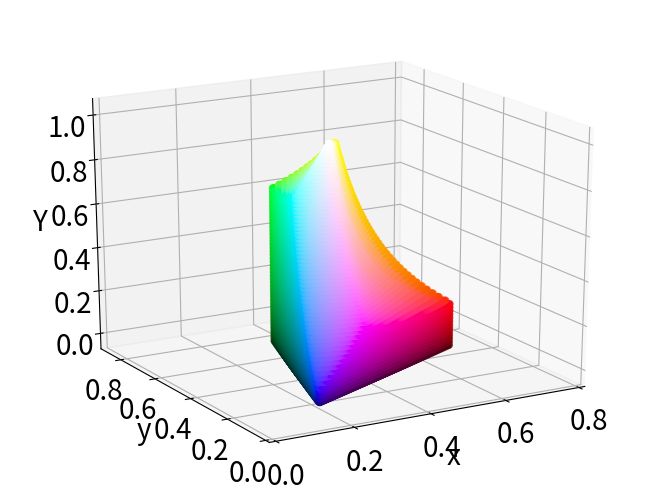
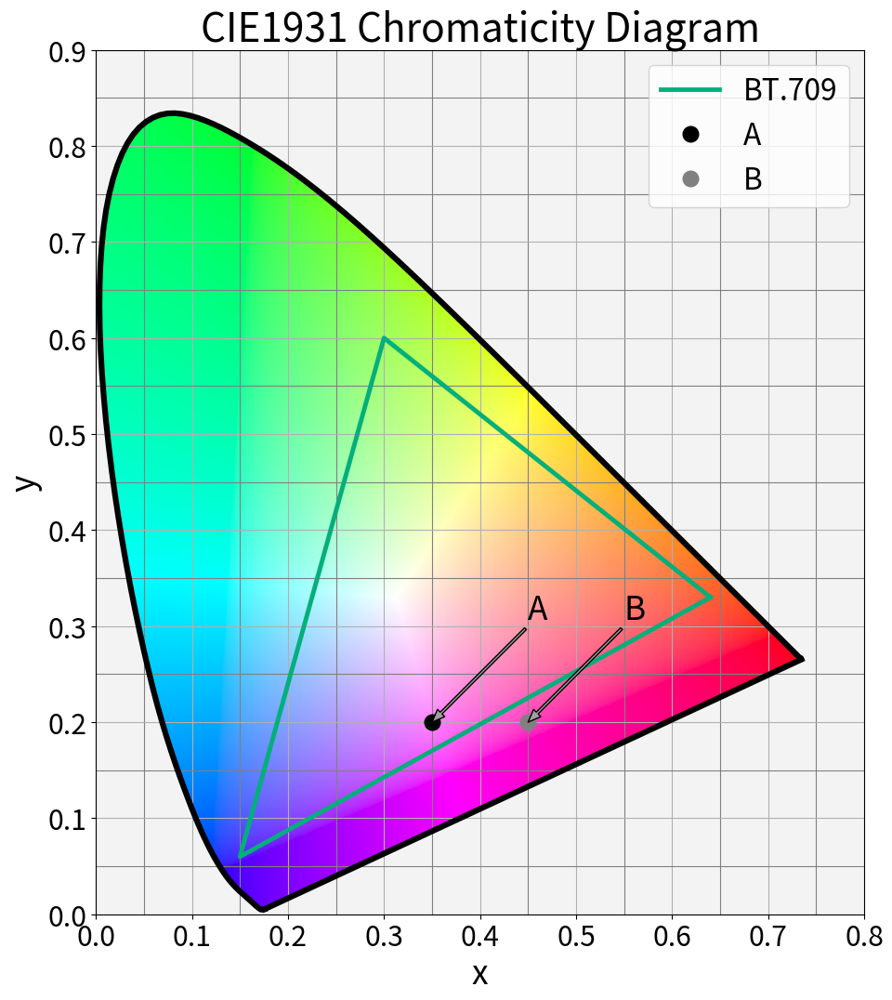
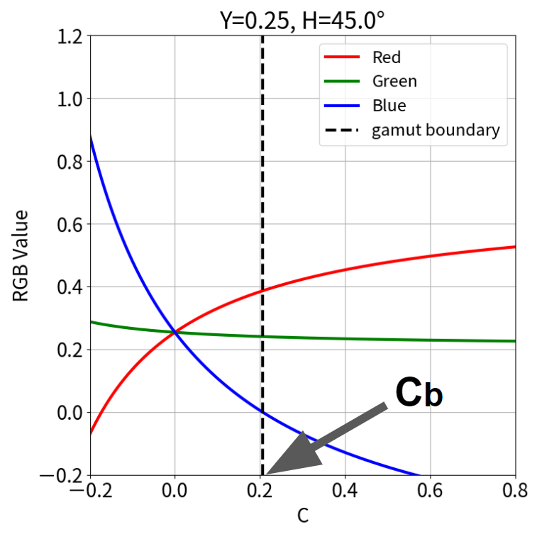

# xyY 色空間で BT.709色域の Gamut Boundary をプロットする

## はじめに

この記事は「Report ITU-R BT.2407 の Annex2 を実装」シリーズの1回目です。完走するか微妙ですが少しずつ記事を書いていきます。

## 背景

少し前にブログで [YouTube の HDR to SDR 変換](https://trev16.hatenablog.com/entry/2019/11/19/220840) の解析を行った。この際に Gamut Mapping に関する知識と経験が少なすぎると痛感したため、勉強のためにアルゴリズムの公開されている方式を1つ実装してみることにした。実装対象は [BT.2407](https://www.itu.int/pub/R-REP-BT.2407) の Annex2（NHKの提案する BT.2020 色域 to BT.709 色域変換）である。

BT.2407 の Annex2(以後、BT.2407と略す) の実装には、CIELAB色空間において BT.2020色域および BT.709色域の Gamut Bounary の算出が必要である。Gamut Boundary の算出方法は AMD の [FreeSync2 HDR の解説](https://gpuopen.com/using-amd-freesync-2-hdr-gamut-mapping/) ページ[2]でも言及されているが、今回は勉強も兼ねて筆者の独自方式で算出することにした。

しかし、いきなり CIELAB色空間の Gamut Boundary を算出するのは少々敷居が高かったので、まずは xyY色空間で BT.709色域の Gamut Boundary を算出することにした。

## 目的

* xyY色空間で BT.709色域の Gamut Boundary を算出してプロットする。

## 結論

筆者独自方式で xyY色空間での BT.709色域の Gamut Bounadry の算出に成功した。結果を図1に示す。


<div style="text-align: center;">図1. xyY色空ででの BT.709色域の Gamut Boundary</div>

## 算出方法

### 方針

以下の動画のように、xyY 色空間を xy平面の Y方向に対する積み重ねとして表現することで Gamut Boundary を算出することにした。

<iframe width="560" height="315" src="https://www.youtube.com/embed/qFgWx3EaBqE" frameborder="0" allow="accelerometer; autoplay; encrypted-media; gyroscope; picture-in-picture" allowfullscreen></iframe>

したがって、解くべき問題は xyY色空間における **任意の Y に対する xy平面の Gamut Boundary の算出** となる。言い換えると、以下の動画の左画面 の Gamut Boundary を算出するのが目的である。

### 理論

今回は xyY色空間の単純な特性を利用して xy平面の Gamut Boundary を求めることにした。その特性とは **xyY色空間の Gamut Boundary の外側の xyY値 は R, G, B のいずれかの値が 0.0～1.0 の範囲を超える** である。

具体例を図2 を使って説明する。図2 は $Y=0.05$ における xy平面である。


<div style="text-align: center;">図1. xyY色空ででの BT.709色域の Gamut Boundary</div>

図2 に示したように Gamut Boundary の内側に点Aを、外側に点Bを設定する。点A、点B の xyY値はそれぞれ [0.35, 0.2, 0.05], [0.45, 0.2, 0.05] である。この xyY値 を RGB値に変換してみる。

```python
import numpy as np
from colour import xyY_to_XYZ, XYZ_to_RGB
from colour.models import BT709_COLOURSPACE


def calc_point_xyY_rgb():
    D65 = [0.3127, 0.3290]
    a = np.array([0.35, 0.2, 0.05])
    b = np.array([0.45, 0.2, 0.05])
    a_rgb = XYZ_to_RGB(
        xyY_to_XYZ(a), D65, D65, BT709_COLOURSPACE.XYZ_to_RGB_matrix)
    b_rgb = XYZ_to_RGB(
        xyY_to_XYZ(b), D65, D65, BT709_COLOURSPACE.XYZ_to_RGB_matrix)
    print("Point A RGB Value = ({:.3f}, {:.3f}, {:.3f})".format(a_rgb[0], a_rgb[1], a_rgb[2]))
    print("Point B RGB Value = ({:.3f}, {:.3f}, {:.3f})".format(b_rgb[0], b_rgb[1], b_rgb[2]))


calc_point_xyY_rgb()
```

```text
Point A RGB Value = (0.151, 0.014, 0.114)
Point B RGB Value = (0.244, -0.012, 0.089)
```

すると 点A は R, B, G が 0.0～1.0 の範囲に収まっているのに対して、点Bは 0.0～1.0 は範囲を超えている事がわかる。このように、Gamut Boundary の外側の xyY値は 0.0～1.0 の範囲を超えてしまう性質がある。

さて、本題の Gamut Boundary 算出に話を戻そう。今回は次の方針で算出することにした。まず、図3 に示すように D65 から角度 $H$ の方向に直線を引く。この直線の **D65からの距離** を $C$ とする。直線上の xyY値を $C$ を変数としてRGB値に変換した様子を図4 に示す。

|  | |
|:---:|:---:|
|図3. 変数定義|図4. 角度 $H$ の直線上の xyY値を $C$ を変化させながら RGBに変換した様子

図4 を見ると $C$ が小さいうちは R, G, B の値は 0.0～1.0 の範囲に収まっているが、$C$ が大きくなると R, G, B のいずれかの値が 0.0～1.0 の範囲を超えることが分かる。したがって R, G, B のいずれかの値が **最初に** 0.0～1.0 の値を超えた $C$ の位置が求める Gamut Boundary となる。ここを $C_b$ と置く。

このようにして角度 $H$ に対する Gamut Boundary を求めることができる。あとは $H$ を 0～360° まで変化させれば xy平面の Gamut Boundary を計算できる。

$H$ を少しずつ変化させながら Gamut Boundary をプロットする例を以下の動画に示す。この動画では Y=0.25 の xy平面の Gamut Boundary を算出している。

## 考察というか感想

馬鹿正直に地味な計算を繰り返しているため、得られる成果と比較して計算量がアホみたいに多くなってしまったが、とりあえず目的は達成できた。次は CIELAB色空間の Gamut Boundary を求める。

## 参考資料

[1] Report ITU-R BT.2407, "Colour gamut conversion from Recommendation ITU-R BT.2020 to
Recommendation ITU-R BT.709", https://www.itu.int/pub/R-REP-BT.2407

[2] AMD, "Using AMD FreeSync 2 HDR: Gamut Mapping", 2019, https://gpuopen.com/using-amd-freesync-2-hdr-gamut-mapping/