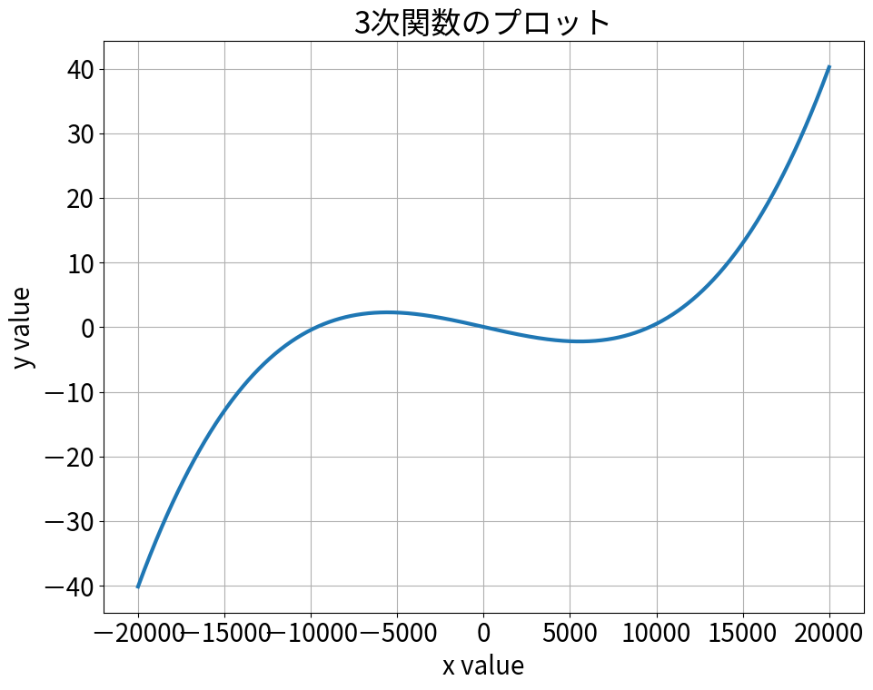

# Sympy で 3次方程式を解いた際の奇妙な挙動の解析

## 1. 背景と目的

とある事情により数万～数十万個の3次方程式を解くことになった。
世の中には方程式の解を求めてくれる便利なライブラリがあるため、それを利用して解くことにした。

最初に練習として数百個の3次方程式を解いたところ、一部の式において筆者の想定と異なる解が求まることが分かった。本記事ではこの**想定と異なる解**が求まった原因と対応策について記録を残す。

## 2. おことわり

筆者が2次以上の方程式をライブラリを使って解いたのは今回が初めてであり、数値計算に関する知識は非常に乏しい。そのため調査方針から最終結論に至るまで見当違いの内容を書いている可能性がある。注意して頂きたい。

## 3. 想定と異なる解とは

なにはともあれ、まずは実際に筆者が遭遇した例を示す。

### 3.1. 定式化

まず、以下のように3次方程式を定義する。

$$
y = ax^3 + bx^2 + cx + d
$$

この方程式を $y=0$ について解くことを考える。なお、係数 $a, b, c, d$ の値は以下の通りである。

$$
a = 6.54 \cdot 10^{-12} \\
b = 1.14 \cdot 10^{-11} \\
c = -6.07 \cdot 10^{-4} \\
d = 0.0359
$$

### 3.2. 3次関数のプロット

関数をプロットすると図1. のようになる。


<div style="text-align: center;">図1. 3次方程式をプロットした様子</div>

図1を見ると $-10000, 0, 10000$ 付近に解があることがわかる。

### 3.3. 解を算出

解についてアタリがついたところで、ライブラリを使って実際に方程式を解いてみる。
今回使用するライブラリは Python の Sympy である。解くのに使用したコードは以下の通り。

```python
from sympy import symbols
from sympy.solvers import solve

def solve_cubic_function():
    x = symbols('x')
    a = 6.54 * (10 ** -12)
    b = 1.14 * (10 ** -11)
    c = -6.07 * (10 ** -4)
    d = 0.0359
    expr = a * (x ** 3) + b * (x ** 2) + c * x + d
    solution = solve(expr)
    print(solution)


if __name__ == '__main__':
    solve_cubic_function()
```

これを実行すると以下が出力される。

```
[-9664.27959977099 - 0.e-19*I, 59.1456227815362 + 0.e-19*I, 9603.3908577234 - 0.e-19*I]
```

なんと、実数解ではなく虚数解が得られてしまった。グラフを見る限りだと普通に $y=0$ と交差しているので、簡単に3つの実数解が得られると考えていたが結果は違った。

## 4. 原因と対策について

この症状について原因と対策について調査した。

### 4.1. 原因

情けない話だが、なぜこうなるのかは分からなかった。虚数成分が非常に小さな値だったので丸め誤差などの類だとは思うのだが、どうして発生するのかは分からなかった。

### 4.2. 対策(とりあえず上手く行ってる版)

非常に情けない話だが、良い対策方法を見つけることはできなかった。

とりあえず筆者は、以下のように **虚数成分が一定値未満** だった場合は実数解とみなすコードを書いて誤魔化すことにした。こんな判別のしかたで良いのか不安が残るものの、今の所はこの方式で凌ぐことができている。

```python
def solve_cubic_function2():
    threshold = 10 ** -10
    x = symbols('x')
    a = 6.54 * (10 ** -12)
    b = 1.14 * (10 ** -11)
    c = -6.07 * (10 ** -4)
    d = 0.0359
    expr = a * (x ** 3) + b * (x ** 2) + c * x + d
    solutions = solve(expr)

    real_solutions = []
    for value in solutions:
        real_val, im_val = value.as_real_imag()
        if abs(im_val) < threshold:
            real_solutions.append(real_val)

    print(real_solutions)
```

```
[-9664.27959977099, 59.1456227815362, 9603.39085772340]
```

### 4.3. 対策(失敗した版)

参考までに色々と試したうちの一例を紹介しておく。`symbols` の引数に `real=True` をつけることで `solve` で得られる解は実数解のみとなる。そこで以下のようなコードを組んでみた。

```python
def solve_cubic_function():
    x = symbols('x', real=True)  # <-- ここを変更した。
    a = 6.54 * (10 ** -12)
    b = 1.14 * (10 ** -11)
    c = -6.07 * (10 ** -4)
    d = 0.0359
    expr = a * (x ** 3) + b * (x ** 2) + c * x + d
    solution = solve(expr)
    print(solution)
```

これを実行したところ **解なし** になってしまった。悲しい。

## 5. 感想

色々と勉強不足なのを痛感した。もっと大学で色々と勉強しておくんだった…。


## 6. 参考資料

* Stack Overflow, "What's wrong with this function to solve cubic equations?", https://stackoverflow.com/questions/16270941/whats-wrong-with-this-function-to-solve-cubic-equations

* Sympy, "Solveset", https://docs.sympy.org/latest/modules/solvers/solveset.html#solveset

