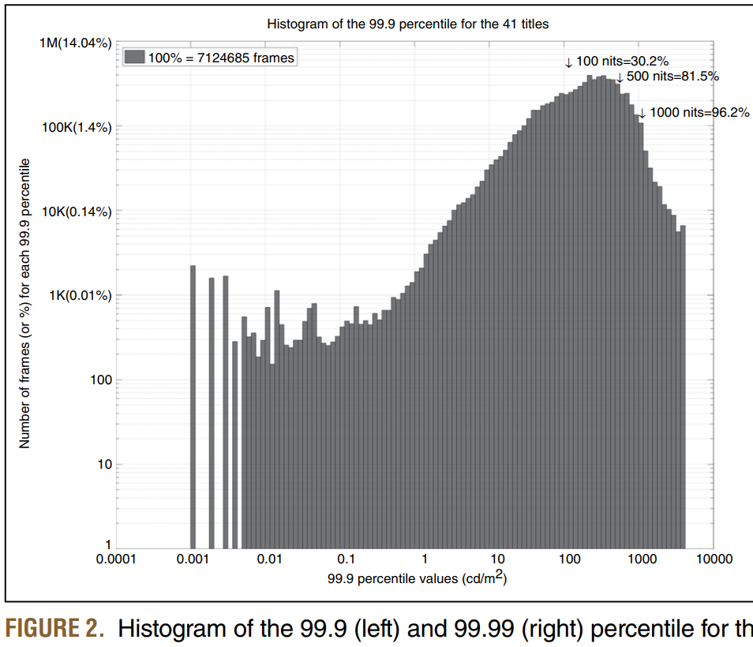
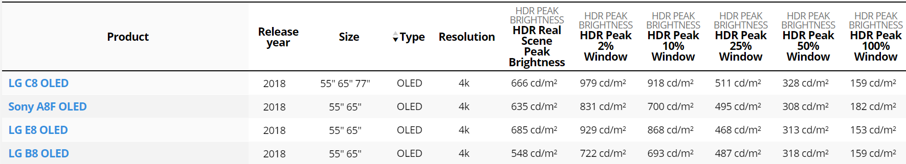
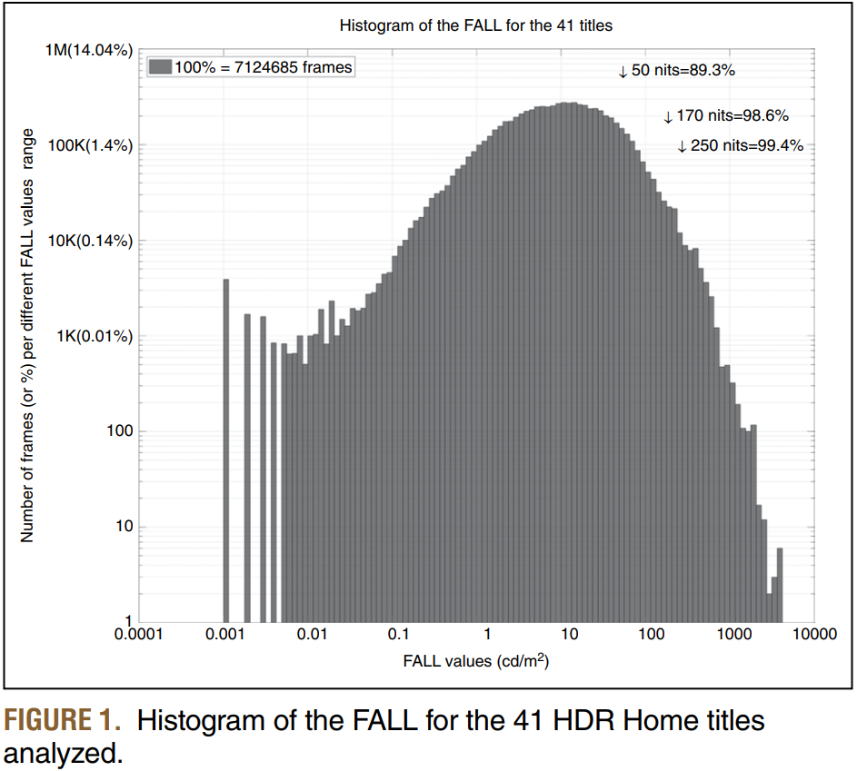
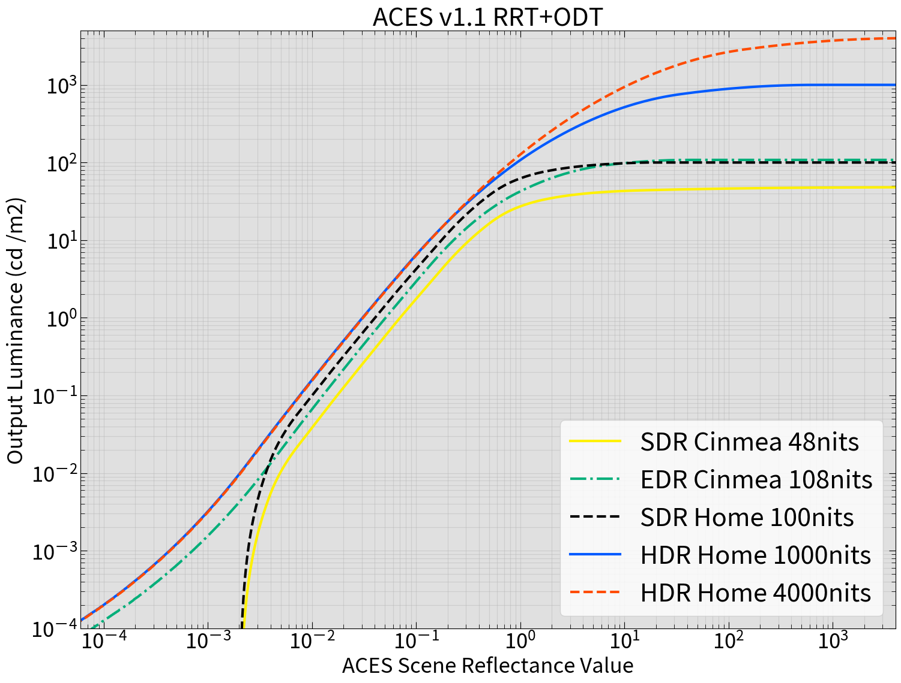
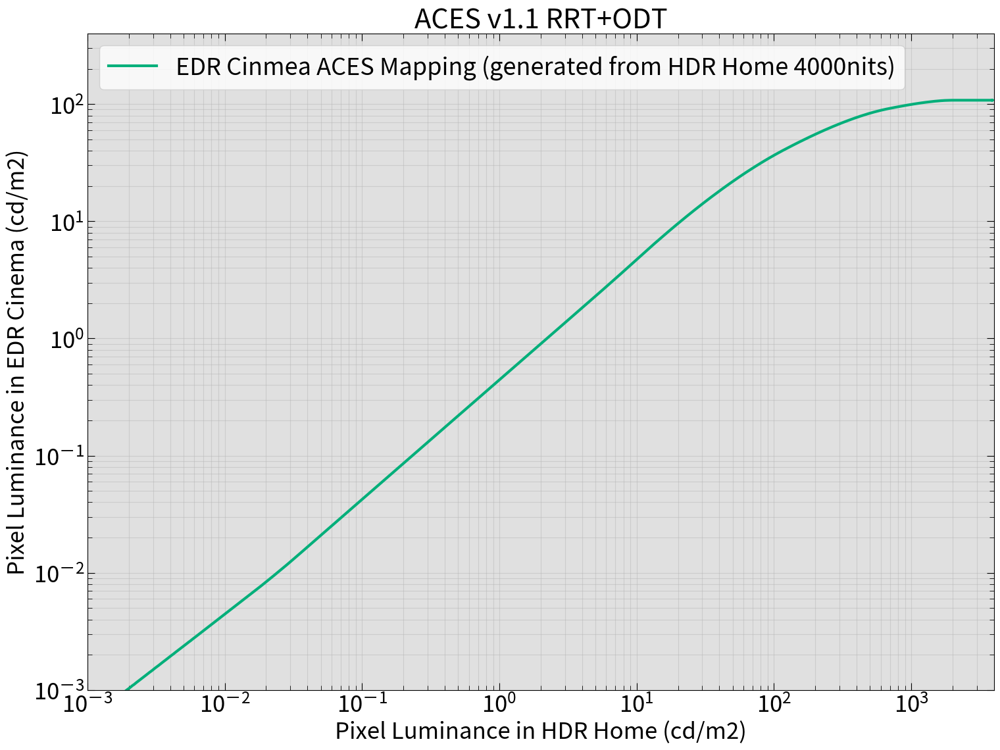

# HDRの映画に関する Technical Paper を読んだ

## 背景

最近、全然 Technical Paper を読んでなかったので久しぶりに読むことにした。今回読んだのは Predicting HDR Cinema Requirements from HDR Home Master Statistics[1] である。

隔月で発行される SMPTE の Motion Imaging Journal には幾つかの Technical Paper が寄稿？されるのだが、その中の1つである。なお、自分は SMPTE のメンバではないため IEEE Xplore でバラ買いした。\$33であった。

以下、読んで気になった点のメモを残しておく。個人的に興味を惹かれた箇所のまとめであり、Technical Paper の翻訳では無い。注意して頂きたい。

## Technical Paper の背景と目的

* HDRの規格化が進み家庭用向けを中心に HDRコンテンツが増えてきた
* Cinema に関しては Dolby Cinema があるものの、最大輝度が 108 cd/m2 と大幅に制限されている
* 今後、デバイスの進化により高輝度な HDR Cinema(Dolby Cinema とは異なる) の実現が予想される
* その HDR Cinema に関して以下のスペックを見積もる
  * Peak Luminance (このブログでは以後 ピーク輝度 と呼ぶ)
  * Display Power Budget (このブログでは以後 平均輝度※ と呼ぶ)
* そのために、Warner Bros. の 41タイトルの HDR作品を分析した

※フルスクリーンで最大の Video Signal を表示した場合にどれだけの輝度をだせるか、という指標のため 平均輝度 と呼ぶことにした（例えば Technical Paper では「SONY の BVM-X300 の Peak Luminance は 1000cd/m2、Display Power Budget は 170cd/m2 だ」といった使い方をしている）

## 用語整理

以後の説明で使用する特殊な用語を列挙する。なお これらの用語は最後を除き「配信システム全体」を示す用語ではなく、「ピーク輝度」・「平均輝度」のスペックを示す用語として使用する。

| 用語 | ピーク輝度 | 説明 |
|:-----|-----:|:-----|
| SDR Cinema | 48 cd/m2| DCI が規格化した現行の Digital Cinema[2] |
| EDR Cinema | 108 cd/m2 | Dolby が 行っている Dolby Cinema。ここでは後述の HDR Cinema と区別するため、EDR(Enhanced Dynamic Range) という言葉を使う|
| SDR Home | 100 cd/m2 | BT.709 規格の SDR |
| HDR Home | 4000 cd/m2 | HDR10 などに代表される 家庭向けの HDR。ピーク輝度はここでは 4000cd/m2 とする |
|FALL | - | Frame Average Light Level の略。フレームの平均輝度 |

## Technical Paper で興味深かった点

以下の3点である。それぞれについて詳しく書いていく。

* HDRコンテンツで高い輝度(500cd/m2以上)が使われる割合は少ない
* HDRコンテンツを表示するデバイスはフルスクリーンでピーク輝度を出せなくて良い
* (かなり個人的な話だが) ACES V1.1 の 108cd/m2 用の RRT+ODT は横軸を HDR Home の輝度値にしてプロットすると分かりやすい

## HDRコンテンツで高い輝度が使われる割合は少ない

HDR作品と聞くと1000 cd/m2, 2000 cd/m2 といった高輝度でビカビカ光る画をイメージする人もいるが、実際のところ高輝度が使われるシーンは限定的である。Technical Paper では、41タイトルの HDR Home 作品を分析してそれを示している。

Technical Paper の FIGURE2 を以下に示す。図の見方について説明する。

まず、あるフレーム(3840x1600px)に対して、各ピクセルの輝度値を算出する。次に、各ピクセルの輝度値の統計を取る。そして「99.9% のピクセルが X cd/m2 未満」という条件を満たす X の値を求める。

これを、41タイトルの 7,124,685 フレームについて行い X を横軸としてヒストグラムを作った結果が FIGURE2 である。

FIGURE2 より多くのフレームでは高輝度を必要としていないことが分かる。例えば、81.5% のフレームは 99.9 のピクセルが 500cd/m2 未満である。このことから、多くのフレームの大部分はピーク輝度が 500cd/m2 程度の表示デバイスでも問題なく表示できることが分かる。

## HDRコンテンツを表示するデバイスはフルスクリーンでピーク輝度を出せなくて良い

意外と知らない人も多いのだが、昨今のHDR対応表示デバイスは全画面でピーク輝度を維持することができない。例として [RTINGS.com](https://www.rtings.com/) での評価結果の一部[3]を以下の図1に示す。

一番右側が全画面で最大の Video Signal を表示した場合の輝度である。2% Window を表示した場合と比較して大きく輝度が落ちることが分かる。

この数字だけを見ると「欠陥品じゃないか！」と怒り出す人もいそうだが、輝度が下がっても実はそれほど問題ではない、というのが Technical Paper で示されている。

それを示したのが FIGURE1 である。図の見方について説明する。

まず、あるフレーム(3840x1600px)に対して、各ピクセルの輝度値を算出する。それを全ピクセル数で割って平均値(FALL)を求める。これを、41タイトルの 7,124,685 フレームについて行い FALL を横軸としてヒストグラムを作った結果が FIGURE1である。

FIGURE1 より多くのフレームでは平均輝度が さほど高くないことが分かる。170 cd/m2 あれば 98.6% のフレームは問題なく表示できることが分かる(極端に高いピーク輝度が要求されていなければ)。

こうした分析により、先ほどの図1のような特性をもつ表示デバイスでもHDRコンテンツの表示に大きな問題が生じないことが分かる。

## ACES V1.1 の 108cd/m2 用の RRT+ODT は横軸を HDR Home の輝度値にしてプロットすると分かりやすい

ここは完全に自分用のメモなので少し雑に書く。

ACES の RRT+ODT については過去に記事で簡単な調査を行ったことがある。

https://trev16.hatenablog.com/entry/2019/07/07/153215

その時は図2のようなグラフを書いた。で、ここの横軸は ACES空間の値となっており、0.18 が 18% Gray に相当するが実際の輝度値ではない。そのため、頭で色々と考えるのが少し難しい。

そこで視点を変えて 図3のように横軸を HDR Home 4000nits 基準でプロットしてみると分かりやすくなる。これは横軸が PQ の EOTF で Luminance に変換された値なので、実際の輝度値である。なので「Dolby Cinema だと xxx nits が yyy nits にマッピングされる」といった分析がしやすくなる……気がした。

## 感想

久しぶりに Technical Paper を読んだら面白かった。本当は FALL とピーク輝度の相関関係の話についても本ブログで言及したかったのだが、作業時間が無くなってしまったので断念した。興味のある方はオリジナルの Technical Paper を読んで欲しい。

次は BBC の WHP 369 「Display of High Dynamic Range Images Under
Varying Viewing Conditions」を読みたいと思った。

## 参考資料

[1] Ronan Boitard, Michael Smith, Michael Zink, Gerwin Damberg, and Anders Ballestad, "Predicting HDR Cinema Requirements from HDR Home Master Statistics", SMPTE Motion Imaging Journal, vol. 128, pp. 1-12, 2019.

[2] SMPTE RP 431-2, "D-CINEMA QUALITY - REFERENCE PROJECTOR & ENVIRONMENT"

[3] RTINGS.com, "Peak Brightness of TVs", https://www.rtings.com/tv/tests/picture-quality/peak-brightness

