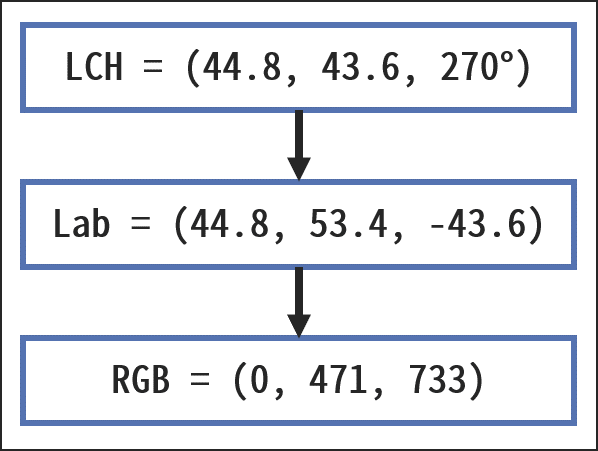

# BT.2020 to BT.709 の Gamut 変換が実装できた

## 1. はじめに

この記事は「Report ITU-R BT.2407 の Annex2 を実装」シリーズの3回目です。
かなり間が空きましたが失踪せずに少しずつ実装を進めていました。
無事に Rev01 の実装が完了したので結果を報告したいと思います。

## 2. 目的

BT.2407 Annex2 に記載の BT.2020 to BT.709 の Gamut Mapping を実装する。

自身の環境を踏まえて以下の点を意識した実装とする。

### ①Limited Range の信号前提ではなく Full Range の信号を前提とした処理とする。

BT.2407 Annex2 は NHKが考案した方式ということもあり、現在のTV放送に使用されている Limited Range の信号（940Lv～1019Lv の Overwhite 領域も含む）で扱えるように、CIELAB色空間を少し拡張して処理を行っている。

一方で自分は基本的に RGB444 Full Range の信号処理にしか興味が無いため、Limited Range を考慮した処理は行わないこととした。

### ②DCI-P3 to BT.709 の変換も視野に入れた実装とする

BT.2407 Annex2 は BT.2020 to BT.709 変換に最適化したアルゴリズムとなっている。が、自分は BT.2020 以外にも DCI-P3 の信号も扱うことが多い。そのため将来的には本実装を DCI-P3 to BT.709 変換にも応用したいと考えている。

こうした背景もあり BT.2407 Annex2 の Hue Mapping は今回の実装には盛り込まないこととした。
理由は BT.2020 to BT.709 に特化したマジックナンバーが複数あり、DCI-P3 to BT.709 変換への応用が困難だと判断したからである（※）。

※偉そうに書いていますが、要は自分の頭ではマジックナンバーの意味を正しく理解することが無理だったということです。おバカでごめんなさい…。

## 3. 結論

なんとか実装した。加えて簡単に扱えるように 3DLUT化も行った。効果確認用のテストパターンを図1に、図1をBT.2020 to BT.709 変換した結果を図2～図6に示す（はてなブログの画像圧縮を嫌って、Google Drive から画像を引っ張ってきています。表示に少し時間がかかる場合があります）。

なお、左上に黒いポチのあるブロックは BT.709 の Color Volume 外であることを意味する

* 図1：BT.2020空間での評価用テストパターン（BT.2020カバー率100%の表示デバイスでご確認下さい）
* 図2：BT.2020空間での Gamut Mapping の実行結果（BT.2020カバー率100%の表示デバイスでご確認下さい）
* 図3：BT.2020 to BT.709 の Gamut Mapping したものを BT.709 色域で表示したもの（一般的な BT.709色域の表示デバイスでご確認下さい）
* 図4：BT.2020 to BT.709 を 3x3 の Matrix で変換したものを BT.709 色域で表示したもの（一般的な BT.709色域の表示デバイスでご確認下さい）
* 図5：図1と図2をアニメーションで切り替え（BT.2020カバー率100%の表示デバイスでご確認下さい）
* 図6：図3と図4をアニメーションで切り替え（一般的な BT.709色域の表示デバイスでご確認下さい）

|  |  |
|:--:|:--:|
|||
| 図1. 効果確認用テストパターン(BT.2020, Gamma=2.4)     | 図2. 図1 を Gamut Mapping した結果(BT.2020, Gamma=2.4) |

|  |  |
|:--:|:--:|
||||
| 図3. 図1 を Gamut Mapping した結果(BT.709, Gamma=2.4) | 図4. 図1 を 3x3 の Matrix で BT.2020 to BT.709 変換した結果(BT.709, Gamma=2.4)|

| | |
|:--:|:--:|
| | |
|図5. 図1と図2をアニメーションで切り替え(BT.2020, Gamma=2.4) | 図6. 図3と図4をアニメーションで切り替え(BT.709, Gamma=2.4)|


(BT.2020のディスプレイが無いと判断できないのだが)作成したテストパターンへの適用結果を図1に、128x128x128のカラーパッチに対する変換結果を図2に示す。

なお、図2は 3DLUTを使った変換結果も含んでいる。図の見方は記事の後半に書いてあるので、ここでは詳細を省略する。

作成した 3DLUT はココに置いた（使う人は居ないと思いますがトラブルが発生しても責任は負えません）。

## 4. 理論

### 4.1. 概要

BT.2407 Annex2 の Gamut Mapping について簡単に説明する。

まず大前提として Gamut Mapping は CIELAB色空間で行う。IPT や CIECAM02 などを使わない理由は、BT.709 の色域外の彩度が高い領域で人間の視覚特性とマッチしない箇所があるためである。

さて、Gamut Mapping は以下の3つの要素から成り立っている。このうち Hue Mapping は冒頭で述べた理由により実装しない。

* Lightness Mapping
* Chroma Mapping
* Hue Mapping

続いて Lightness Mapping と Chroma Mapping の概要について説明する。この2つの Mapping は CIELAB色空間から算出できる Chroma-Lightness平面上で行う。この平面上で処理を行うことにより、Mapping の前後で CIELAB色空間での Hue は維持される。

BT.2407 Annex2 の Mapping 方法を説明する前に、そもそも Mapping の方法にはどういったものが考えられるか例を挙げておく。以下の図3 では Chroma-Lightness平面のある点(a) を Mapping している。


図3. Chroma-Lightness 平面上での Gamut Mapping の例


図から読み取れるように BT.709 の色域外のデータを BT.709 の色域内に収める方法にはバリエーションが存在する。例えば (b) は Lightness の保持を最優先として、Chroma が大幅に減少したとしても Lightness を保持するようにしている。一方で (c) は Chroma を最優先して、Lightness が大幅に減少したとしても、Chroma を保持するようにしている。他にも Chroma-Lightness平面上でのユークリッド距離を最小化する、などの方法も考えることができる。

さて、今回実装した BT.2407 Annex2 は (d) に示した方法となっている。(b), (c) の中間のような感じである。この座標がどのように算出されるのか以降で説明していく。

### 4.2. 詳細

先程の図3 の (d) に示した Mapping を実現するために、BT.2407 Annex2 では L_focal, C_focal と呼ばれる点を設定し、この点を基準として Gamut Mapping を行う。順を追って説明する。

### 4.2.1. L_focal の生成

L_focal を求めるには以下のステップを経由する。

1. BT.709 cusp と BT.2020 cusp を計算
2. 上記の2つの cusp から L_cusp を計算
3. L_cusp の範囲を制限することで L_focal を生成

BT.709 cusp と BT.2020 cusp はそれぞれ Chroma-Lightness平面で最も Chroma が大きい点を意味し、L_cusp は BT.709 cusp と BT.2020 cusp を通る直線と Lightness軸との交点を意味する。図4の動画を見れば、意味が通じると考える。

```text
ここに動画
```

L_cusp は L_focal の値を制限することで作られる（※）。制限した結果を図に示す。


※制限する明確な理由はまだ自分の中では明らかになっていない。

### 4.2.2. C_focal の算出

次に C_focal の算出方法について説明する。C_focal は BT.709 cusp と BT.2020 cusp を通る直線と Chroma軸 との交点の絶対値である。したがって、以下のように2パターンが存在する。

| パターン | 図 |
|:-------:|:-------:|
| (a) | |
| (b) | |

(a) は Chroma軸との交点が正の値となるケース、(b) は Chroma軸との交点が負の値となるケースである。いずれにせよ絶対値を取るため最終的な C_focal は以下のようになる。なお、筆者の実装は後述するように複数のLUTを組み合わせていることもあり、量子化誤差が随所で発生する。C_focal についても量子化誤差は発生しており、これを防ぐために LPF を適用してある。ご了承頂きたい。

### 4.2.3. L_focal, C_focal を基準とした Mapping 処理

L_focal, C_focal が決まれば後はこの点を基準に Mapping を行えば良い。具体例を図に示す。

図から分かるように、L_focal, C_focal を結ぶ直線の上側のデータは L_focal へ収束するように、下側のデータは C_focal から発散するような直線上で Mapping を行う。

Mapping先は BT.709 の色域の境界である。この方法だと focal を基準とした直線上のデータは同一の Chroma, Lightness値に Mapping されるため色潰れが生じることを懸念するかもしれない。しかし色潰れが生じる可能性は極めて低い。実画像では Chroma が変化するとともに Lightness も変化するが、その変化が focal を基準とした直線に乗り続ける可能性が低いからである。この直線から外れると Mapping 後の値にも差が生じるため色潰れが生じることはない。

## 5. 実装

### 5.1. 処理の大まかな流れ

初めに処理の大まかな流れを説明しておく。以下の図を参照して欲しい。

1. 入力のRGB(Gamma=2.4)を CIELAB(Lab), LCH(Lightness, Chroma, Hue) に変換
2. 該当する Hue の Chroma-Lightness平面をプロット
3. BT.709 Cusp, BT.2020 Cusp を算出
4. L_cusp, L_focal, C_focal を算出
5. 入力の LCH から L_focal を使うのか C_focal を使うのか判別
6. 判別した focal 基準で BT.709 の Gamut Boundary に Mapping
7. Mapping 後の LCH から RGB(Gamma=2.4)を算出する

|項目|L_focal 基準の変換例|C_focal 基準の変換例|
|:---:|:---:|:---:|
|1|||
|2||
|3, 4, 5||
|6||
|7||

さて、上記の処理はそれなりにボリュームのある処理である。画像の全RGB値に対してバカ正直に処理すると非常に時間がかかってしまう。

そこで今回の実装では Mapping処理を「入力のRGB値に依存しない処理」と「入力のRGB値に依存する処理」に分け、前者に関しては事前に計算しておき LUT化することにした。

具体的には以下のLUTを作成した。

* Gamut Boundary 2DLUT
  * BT.709, BT.2020 の Gamut Boundary 情報の入った 2DLUT
* L_focal 1DlUT
  * L_focal 情報の入った 1DLUT
* C_focal 1DLUT
  * C_focal 情報の入った 1DLUT
* Chroma Mapping 2DLUT for L_focal
  * 任意の Chroma-Lightness 平面での L_local からの角度 D_l のデータに対する L_focal からの距離の入った 2DLUT
* Chroma Mapping 2DLUT for C_focal
  * 任意の Chroma-Lightness 平面での C_local からの角度 D_c のデータに対する C_focal からの距離の入った 2DLUT

以降では、LUTの作成および使用方法を交えながら実装内容について説明していく。

### 5.2. BT.709, BT.2020 の Gamut Boundary を算出

前回のブログで記した通り。ただし、この記事で書いた手法は遅すぎたため現在は別の手法を使用して算出している。

### 5.3. BT.709 cusp, BT.2020 cusp の算出

4.2.1. で説明した条件を満たす点を算出するだけであり特記事項はない。5.2. で作った LUT から簡単に求めることが出来る。

### 5.4. L_focal, C_focal の算出

基本的には 5.3. で求めた BT.709 cusp, BT.2020 cusp から機械的に求めるだけで良い。

ただし、5.2. で作成した Gamut Boundary の LUT の量子化誤差の影響で Hue に対して高周波成分は発生する。真の値はガタついてないと推測されるため、LPF を適用して高周波成分を除去した。また、C_focal に関しては LPF に加えて以下の2点の追加処理を実行している。

1. 無限大になる値は付近の値から適当に補間
2. 最大値を5000以下に制限


結果を以下に示す。

### 5.5. L_focal に収束するデータの Mapping 先の算出

ここで一度、入力信号に対して具体的にどう処理をしていくのか整理する。

入力の RGB 信号は RGB --> CIE 1931 XYZ --> CIELAB の順に変換される。続いて Chrom-Lightness 平面で処理できるように、Lab --> LCH 変換する。得られた Hue に相当する Chroma-Lightnes 平面を生成し平面上に点を打つ。この点が L_focal および C_focal への直線を求めて、その直線と BT.709 色域の交点にマッピングをする。

## 6. 検証

## 7. 考察

## 8. 参考文献

[1] Report ITU-R BT.2407, "Colour gamut conversion from Recommendation ITU-R BT.2020 to Recommendation ITU-R BT.709", https://www.itu.int/pub/R-REP-BT.2407
