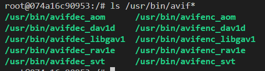

# README

## Build and Execute(background mode)

```powershell
docker build -t takuver4/avif:rev04 .

docker run -it -d -v C:\Users\toruv\OneDrive\work\sample_code\2021\03_investigate_avif:/work/src takuver4/avif:rev04
```

## Interactive

```powershell
docker run -it -v C:\Users\toruv\OneDrive\work\sample_code\2021\03_investigate_avif:/work/src takuver4/avif:rev04 bash
```

## Binaries


